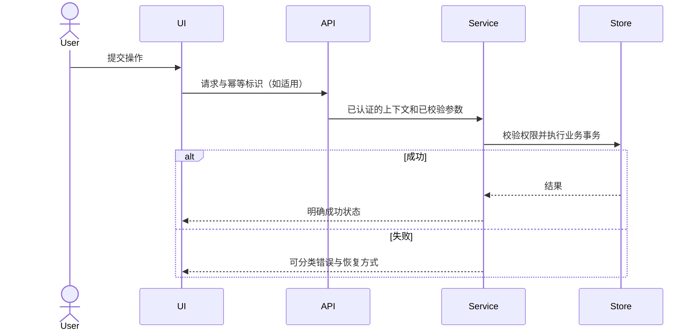

# <功能域> 技术总体方案

状态：草案 / 待人工评审 / 已批准；需求来源：<路径与稳定子句ID>。
本文件状态文字不是机器批准；批准通过内容摘要凭证记录。

## 1. 范围、验收、非目标

当前里程碑的可观察结果；后续能力仅画边界，不提前写全部实现。
列出关键成功场景、异常状态、权限和数据保证。未知项明确标记待决。

## 2. 系统边界与能力地图

现有模块、拟增模块、依赖方向、所有者、输入输出。
每个能力说明“使用者是谁、提供什么契约”，不是按目录机械划分。

## 3. 核心流程



替换为项目真实核心流程，不适用的环节删去；标注同步/异步、事务边界及外部系统。

## 4. 核心契约和数据

请求/响应、事件、错误码、权限范围、数据生命周期、幂等/一致性/兼容性。
将复杂契约作为独立正式输入，不能只在聊天中口头约定。

## 5. 关键决策伪代码

```text
handle(request, actor):
    validate_input(request)
    authorize(actor, request.resource)    # 不能只依赖前端隐藏按钮
    existing = find_completed_operation(request.idempotency_key)
    if existing is valid_for_this_request:
        return existing.result
    result = execute_in_defined_transaction_boundary(request)
    persist_result_and_required_evidence(result)
    return public_contract(result)
```

此为说明模板，不是可以直接用于生产的并发幂等实现。真正方案须补唯一约束、原子占用、崩溃窗口及重试语义（适用时）。
只对真正复杂分支写伪代码，普通 CRUD 不逐行设计。

## 6. UI/交互与状态

代表性页面、批准视觉基线、现有组件、Loading/Empty/Error/Auth/No Access 状态；真实内容和屏宽。
新视觉方向先确认，再扩展整批页面。注明与既有页面、组件和用户指定保留区的兼容边界。

## 7. 风险、替代方案、发布与回滚

说明不选其他方案的原因。迁移、安全、性能、依赖兼容性和恢复策略。

## 8. 验证设计

行为/契约/集成/UI/安全检查映射到验收子句。缺环境怎么办；谁做独立审查；哪些结果必须人工接受。

## 9. 专项方案索引

| 专项 | 为什么需单独展开 | 路径 | 对当前批次是否必须 |
| --- | --- | --- | --- |
| <名称> | <具体复杂性> | <features/...md> | <是/否> |

## 10. 下游资料与上下文路由

### 10.1 已有专用来源

主 PRD、当前总/专项方案、UI 基线只列稳定引用；分别交给 requirements.source、technical_design、ui_baseline，不再复制为 supporting Input。

### 10.2 Change 交付输入

| 具体资料/来源 | 用于什么交付或验收 | 消费能力 | 必需/可选 | 稳定范围或版本 | 上游生产者（如有） |
| --- | --- | --- | --- | --- | --- |

只列真实契约、Schema、数据、设计资产或联调快照；一份共享资料一行，说明所有实际消费者，不为每个 Change 重复列表。
同一消费视图的多个章节写在一个范围中，不按章节拆 Input。尚未产生的资料明确生产者和消费前置条件，不把模板文件当已就绪环境。

### 10.3 项目上下文（不生成 inputs）

只指出现有 AGENTS.md/规范索引路由和必要源码调查入口；不抄录所有工程规范，也不把 router/provider/shared 目录当交付资料。
共同规范应由对应角色按任务读取。一般官方资料和参考文献单列来源，不自动传入每个 Change。
分类遵守 [Manager 输入契约](../../manager-plan-from-doc/references/input-contract.md)；生成项目文档时将此链接改为实际可访问的 Skill 引用，不保留模板相对路径。

## 11. 人工待决事项

列出可裁决选项和影响。未裁决阻塞项不能进入正式实现。
