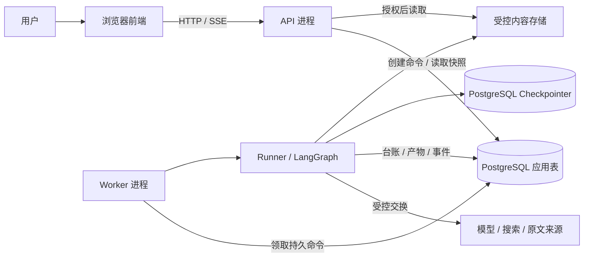
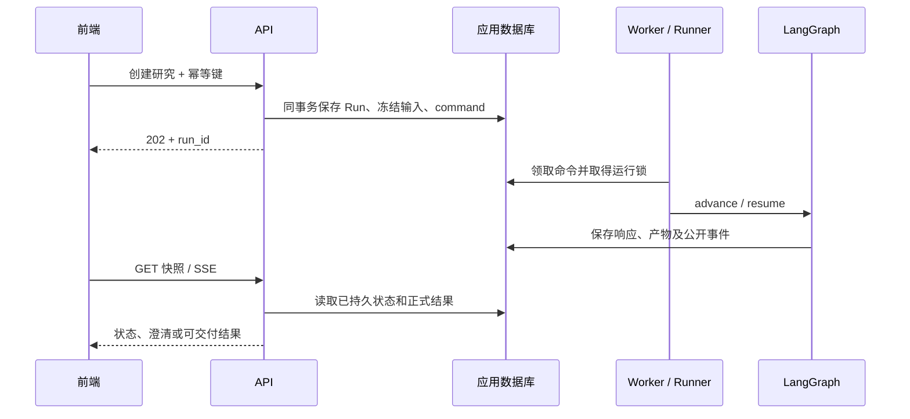

# CompanyLens 系统技术架构

> 架构基线：单仓库、既有前端复用、新 AI 服务合同。后端方案尚未实现；实际进度见[项目状态](../project-status.md)，选型取舍见[ADR-0001](decisions/0001-monorepo-and-stack.md)。

## 1. 目标与系统边界

系统接收公司名称或证券代码，执行资料收集、核验、确定性计算和报告审计，通过 Web 提供进度、澄清、结果及证据查看。产品范围和发布标准由[PRD](../product/prd.md)定义。

架构优先满足证据可追溯、长任务可恢复、外部调用费用可解释和前后端合同一致。模型与搜索是外部能力，原文来源和供应商返回均需验证；网页、模型内容不具有执行或权限授权能力。

## 2. 应用、进程与存储

只有两个应用工程；API 和 Worker 是同一 Python 包的不同进程。上图的应用表与 Checkpointer 可以位于同一 PostgreSQL 实例，但分别管理 schema/迁移。SSE 是状态读取通道，断开不停止研究。

| 部分 | 技术基线 | 责任 |
|---|---|---|
| 前端 | 现有 React / TypeScript / Vite、Router、Query、Axios、Zustand、CSS Modules / Radix UI | 输入、交互状态、报告与证据呈现 |
| API | 设计采用 FastAPI / Pydantic | 参数、身份、scope、用例调用和公开合同 |
| Worker / 研究图 | 设计采用 Python 3.12+ / LangGraph | 领取命令、推进固定图、中断与恢复 |
| 应用持久化 | 设计采用 PostgreSQL、SQLAlchemy / psycopg / Alembic | Run、台账、事件和产物元数据 |
| 图恢复 | PostgreSQL Saver | checkpoint、图任务和中断位置 |
| 内容存储 | 首期设计为受控持久目录 | 原文、大响应和不可变报告正文 |
| 观测 | 本地事件/台账；可选 Langfuse / Noop | 诊断和评估，远端观测不作为事实源 |

前端版本以现有 package/lock 为准；Python 依赖组合在初始化时解析验证。不提前增加 Redis/Celery、独立 RAG 服务或自由 Planner。

## 3. 模块与依赖

| 路径 | 职责 |
|---|---|
| `frontend/src/{app,pages,widgets,features,entities,shared}/` | 按既有前端分层组织，具体目录见[前端架构](../../frontend/docs/frontend/architecture/technology-options.md) |
| `ai-service/src/ai_service/api/` | HTTP DTO、路由、身份和公开事件 |
| `application/` | 创建、回答、继续、取消、修订等用例与事务 |
| `agent_core/` | Runner、调用台账、预算、上下文、产物与事件公共合同 |
| `research/` | 领域对象、研究图、取证、核验、计算、报告与审计 |
| `infrastructure/` | 数据库、模型、网络、存储和观测适配 |
| `resources/research/` | 版本化 prompts、问题矩阵与 policy |
| `bootstrap.py` | 静态注册、依赖注入与客户端生命周期 |

后端依赖为 `api → application → research → agent_core`；infrastructure 实现 core/research 的 ports，bootstrap 装配。core 不反向依赖研究业务或具体适配器。LangGraph 决定阶段与恢复位置；Worker 不重复实现研究主循环。目录按实际切片建立，不预先铺空类。

## 4. 运行路径

首期 `standard_p0` 使用固定图：身份确认 → 问题矩阵 → 取证 → 归一核验 → 计算 → 分析 → 候选报告 → 审计 → 交付。循环上限、条件分支和节点输入输出由[业务设计第9节](../design/AI公司研究_业务架构与接入设计_v1.1.md)维护。

人工回答绑定固定问题、版本和 checkpoint；取消采用协作语义；修订/刷新生成关联新 Run。恢复复用已存外部响应，远端结果不明保留 unknown 与费用预留，不盲目重发。状态机和崩溃窗口详见[执行设计第6–8节](../design/AI-Agent通用模板_技术设计与实现规范_v1.1.md)。

## 5. 数据责任与一致性

| 数据 | 唯一责任与一致性边界 |
|---|---|
| Run、command、回答、事件 | 应用 repository；创建 Run 与 command 同事务，幂等与序号由数据库约束保护 |
| operation / attempt / 用量 | 统一外部调用服务；保存原始响应和已知用量，未知结果独立处理 |
| 图状态 | Saver；保存引用、游标与计数，不承载完整报告库 |
| 原文、证据、指标、计算、报告、审计 | 版本化不可变产物；正文持久化后登记可引用元数据 |
| 前端缓存 | 后端事实的展示副本；不重算金融结果，不以文字流结束推断研究完成 |

首期应用表为 runs、run_commands、operations、operation_attempts、artifacts、run_events、human_responses；详细字段、唯一约束和事务见执行设计第7节。领域对象、Decimal 计算、来源谱系与交付准出见业务设计第6–8、13–14节。

## 6. 前端与接口

复用已有样式、组件、主题、多语言和交互，接口以新服务合同为准。旧 tasks/research-projects 不是后端兼容要求。后端 DTO 导出 OpenAPI 与公开事件 schema，前端在现有 API/repository/mapper 边界接入，生成流程见[工程规范](../engineering/ai-development-standard.md)。

创建研究使用 `/api/v1/research/runs`；通用运行读取、回答、继续、取消与事件位于 `/api/v1/runs`，研究结果与修订位于 research 路由。完整方法、状态码和重连语义只在[执行设计第15节](../design/AI-Agent通用模板_技术设计与实现规范_v1.1.md)维护。

执行状态、研究质量和外部调用状态分别显示；数值、单位、空缺及依据来自结构化结果。接入时核对旧页面状态与新语义，不能仅替换 URL。旧默认代理与迁入限制见[前端迁入记录](../references/frontend-import.md)。

## 7. 部署与运维边界

首期方案为静态前端、同包 API/单 Worker、PostgreSQL 和持久内容目录。生产入口采用同源反向代理；开发通过 Vite proxy 接入 API。具体部署平台和认证实现尚待确定，复制的 Railway 配置不代表已选择本项目部署方案。

本地内容目录要求 API 与 Worker 共用可访问的持久存储。跨主机部署必须先确定共享存储或对象存储；不能依赖容器临时文件系统保存证据。数据库与内容存储需按引用关系制定备份、保留和恢复策略；未完成恢复演练不宣称生产可用。

应用迁移与 Saver 初始化独立；不兼容图/schema 发布前处理在途 Run。公开访问前落实可信身份、逐资源 scope 检查、费用/并发限制和受控下载；观测故障不能改变本地运行事实。

## 8. 质量场景与待定项

| 场景 | 架构验收重点 |
|---|---|
| 相同幂等请求并发提交 | 一个 Run，不重复投递或计账 |
| 已存响应、checkpoint 前崩溃 | 恢复复用响应 |
| 远端结果不明 | 不当作零费用或自动重发 |
| SSE 断线、重复或游标过期 | 去重并校准快照，不重复创建研究 |
| 关键数字或引用审计失败 | 禁止发布该候选，不以 partial 绕过 |
| 访问其他 scope 的结果 | 服务端拒绝，不仅依赖页面隐藏 |

具体回归样本分别由执行设计第12节和业务设计第16节定义；开发任务按影响范围执行。供应商、单次预算、并发量、响应时延、数据保留期、认证与部署方案待实施验证，未确定数值不作性能或费用保证。

实施从[D0 任务](../changes/0001-bootstrap/spec.md)开始，业务里程碑统一见业务设计第16节。完整估值、团队和管理层专项保留设计，按范围逐步实施。
