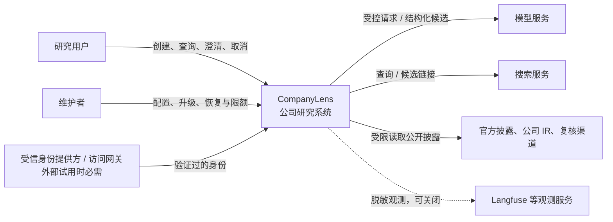
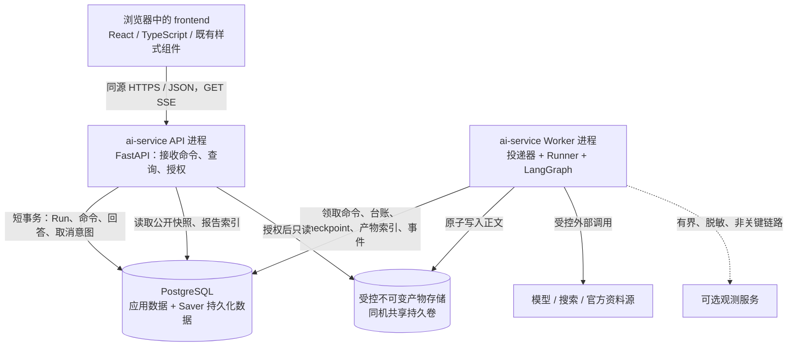
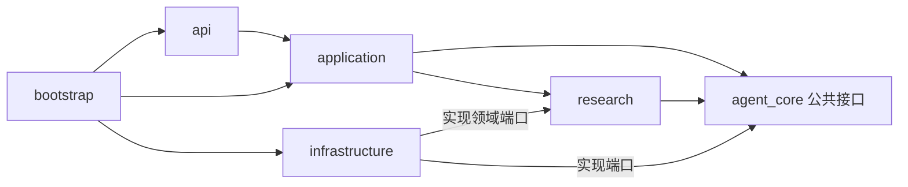
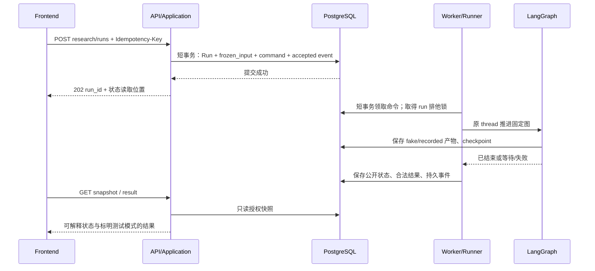
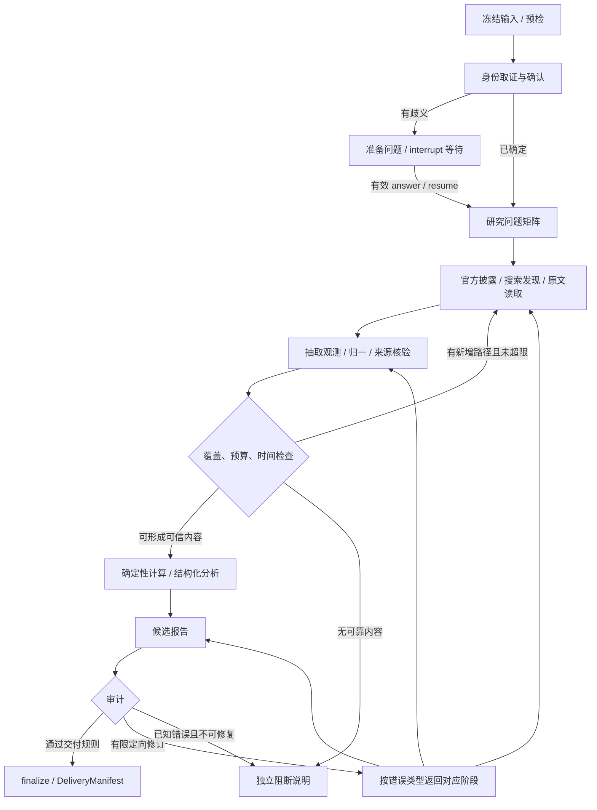
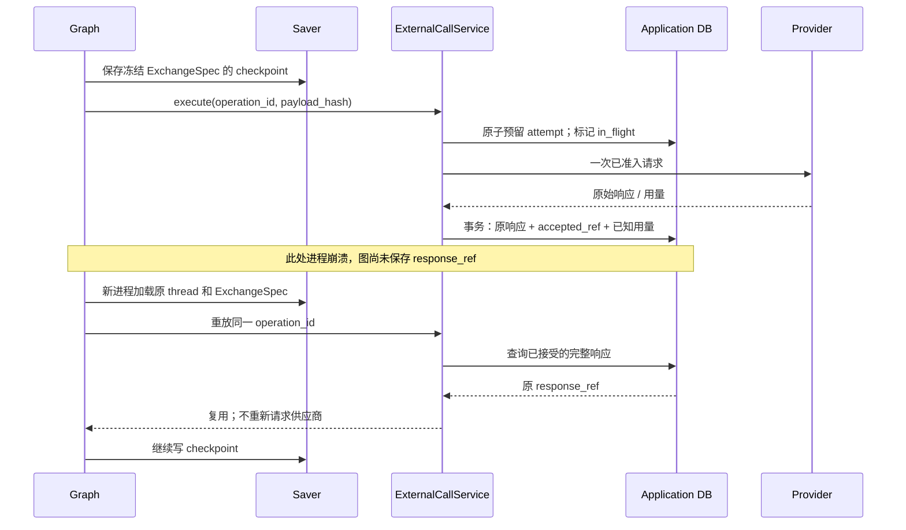
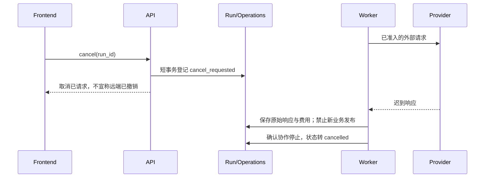
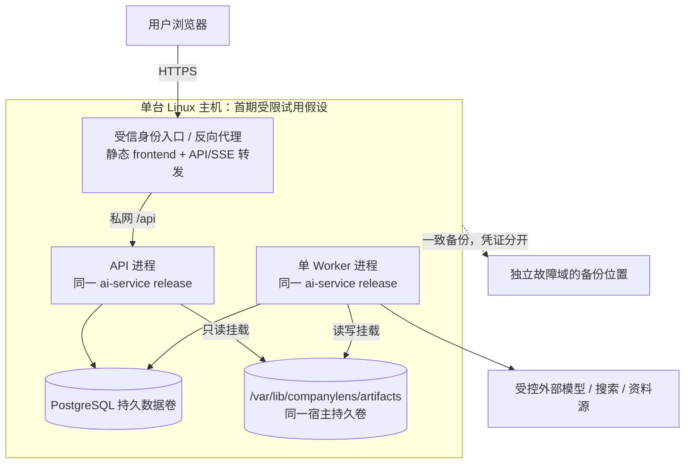

# CompanyLens 系统技术架构

> 文档 ID：CL-SAD-001｜版本：1.0｜日期：2026-09-16  
> 状态：可进入需求拆解的架构建议基线；不是已实施、已评审通过或已运行验收的证明。  
> 建议唯一维护路径：`docs/architecture/ai-architecture.md`。若项目已有 `ai-architecture.md`，在原路径替换正文并修正链接，不同时维护两份。  
> 适用范围：`frontend` + `ai-service` 单仓库；当前 P0 与受限试用前的系统保障。  
> 规划接口：按已核对版本的 `manager-plan-from-doc` 编写；本文件不是 `manager/plan.yaml`，也不授权直接执行开发。

## 0. 文档控制与阅读规则

### 0.1 本文解决什么

本文回答整个系统如何组成、一次研究如何运行、事实与执行数据由谁持有、失败后如何恢复、前后端如何接入，以及怎样证明这些约束成立。它不是 AI 编码风格规范，也不是把所有类、字段、SQL 和提示词写在一起的实现手册。

采用 arc42 作为内容检查表，采用 C4 的系统上下文和应用/数据存储视图，采用 ADR 保存关键取舍。图中的 Container 表示应用或数据存储，不等同于 Docker 容器。方法依据见附录 D；文中的具体技术选择与阈值属于本项目设计，不是这些方法要求的固定答案。

### 0.2 依据、已确认事项与假设

| 类别 | 本文采用的内容 | 证据与处理 |
|---|---|---|
| 本轮用户明确约束 | 单仓库、两个应用目录；保留已有前端 CSS Modules / Radix UI、视觉与交互；按新合同替换旧 API/DTO 接入 | 优先于上一轮 Tailwind/shadcn 的推荐 |
| 已有详细设计 | 通用执行与研究业务两份 v1.1；三市场、证据、计算、预算、恢复、P0 与后续能力分期 | 原样快照随包保留；本文只补系统级边界，不另写金融算法 |
| 本轮新增的设计建议 | 单机共享产物卷、单 Worker、事务边界、发布竞态、快照游标、迁移和质量目标 | 需要实施并验证，不伪称已有代码 |
| 尚未取得的项目事实 | 当前 CompanyLens 代码、现有 `ai-architecture.md`、现有 ADR、实际前端锁文件、Manager 当前计划 | 本文不声称核对过具体组件名、旧接口字段或实际完成度；实施前针对相关模块盘点 |
| 外部核对 | Manager Skill 的正文、schema、planning-rules、preview、plan-write；官方架构方法与技术文档 | 引用只证明规则/框架说明，不证明本系统运行成功 |

不将附件 v1.0 中的 `agent-template/`、`research-agent/`、T/B 分离批次和“不含 HTTP/前端”继续作为当前约束。上一轮工程规范的 Tailwind/shadcn 建议已被本轮的前端复用要求取代。

### 0.3 文档职责与变更规则

| 工件 | 唯一职责 |
|---|---|
| 原始 PRD / 用户确认 | 产品意图、原始范围；原材料保留，不覆写成实施记录 |
| 本文 | 系统边界、关系、运行与数据一致性、部署、可验证系统要求 |
| 两份 v1.1 详细设计 | `agent_core` 执行协议；`research` 数据、计算、业务图与报告规则 |
| [系统接入详细设计](../design/system-integration-details.md) | 本文新增的事务伪代码、存储约束、接口投影、迁移和测试接缝 |
| `AGENTS.md` | 引导 AI 读对应文档、限制变更范围；不复制完整架构 |
| ADR | 单项关键决定的背景、状态、代价及替代方案 |
| `manager/plan.yaml` / OpenSpec | 经确认的工作队列与变更；实现方式进入 `design.md` 和 `tasks.md` |
| 代码、锁文件、验证记录 | 实际实现和实测依据；“计划了”不等于“实现了” |

原始 PRD 沿项目现有路径保存。上一轮交付包使用 `docs/product/prd.md` 与 `docs/product/sources/`；不能声称它们已经存在于当前仓库，也不为满足 Skill 标记把架构全文复制到 `docs/prd/`。

`SYS-*` 表示可观察的系统行为，`AC-*` 表示验收条款；两者定义于第9节。其余结构图、技术表、伪代码是实现约束，不机械提升成新的产品需求。正文中的行为约束均应结合对应 `SYS-*` 拆解；若 Manager 发现未覆盖行为，应补充规范化条款，不能只读取第9节而忽略全文。

本轮不重命名 S01–S11、T01–T06、M01–M10。其完整范围仍在业务详细设计；第1节明确哪些属于当前 P0，哪些只是演进背景。

## 1. 目标、范围与架构约束

### 1.1 当前交付目标

**系统应让用户发起一次单公司研究，在浏览器关闭或执行进程重启后保留可解释状态，最终提供有来源、可复算且明确局限的简版研究。** 研究质量、运行成功和投资确定性分别表达。

| 当前能力 | 范围 | 行为编号 |
|---|---|---|
| 创建研究 | 公司名/代码，CN_A / HK / US；`standard_p0`、`time_mode=current` | SYS-001、002、011 |
| P0 内容 | 两个可比完整财年的收入、明确归属的净利润、CFO、定义清楚的 CapEx、现金与债务；商业模式、主要风险、反证记录 | SYS-013、014 |
| 可复算数字 | 适用的收入同比、净利率、FCF 代理；保留币种、单位、期间和不适用原因 | SYS-013 |
| 交付 | 简版报告、缺口与冲突、逐项证据、计算记录、审计和不可变交付版本 | SYS-012、014、015 |
| 运行控制 | 幂等、可靠执行、真实进度、澄清、取消、继续、修订/刷新、历史查看 | SYS-002–010、016 |
| 接入与安全 | 现有前端复用，新 Run API；作用域隔离、受控外部访问、有限资源 | SYS-017–019、023、025 |

P0 不输出买入/观望/回避、目标价、个人仓位或自动交易。某项原始 S 需求只有 P0 基础部分实现时，不把整个 S 需求标为完成。特殊行业与扫描件可以输出有理由的缺口/阻断，不承诺每家公司均能形成完整报告。

### 1.2 不属于当前实施范围

完整五年/季度研究、完整估值与决策、四角色专家团队、管理层专项、任意历史时点研究保留为后续业务阶段，但**不是本架构当前 P0 规划的必做需求**。当本文件作为 Manager 主来源时，不应把详细设计中的这些未来能力自动加入当前计划。

不建设独立 Agent 平台、动态插件发现、任意代码执行、自动交易、微服务集群、组织 RBAC 后台、订阅计费或独立向量数据库。出现第二个真实业务或明确性能瓶颈时才评估相应扩展。

### 1.3 决定工程形态的条件

| 条件 | 本文基线 | 状态 / 失效条件 |
|---|---|---|
| 首个可运行环境 | 本地个人开发，仅回环访问；默认 deterministic/recorded，无模型费用 | 设计默认；不是公网配置 |
| 首期外部试用 | 同一 Linux 主机、受信认证入口、有限邀请用户；API 与 Worker 独立进程 | 条件化建议；认证和授权未就绪则不得对外开放 |
| 执行并发 | 一个 Worker 进程、同一时刻推进一个 Run；暂停释放执行槽 | 安全起点，不是性能测量结论 |
| 应用持久化 | 一个 PostgreSQL 实例/数据库，应用表与 Saver 管理的数据分工 | 数据库连接与 Saver 包需锁定验证 |
| 原文/报告正文 | 同机持久卷，Worker 可写、API 只读；禁止容器临时层存唯一副本 | API/Worker 分机时该方案立即失效 |
| 费用 | P0 soft 金额预算 + 有限调用/输出/时长；实际金额必须配置并授权 | 无凭证、限额或价格口径不能启用 live |
| 前端 | 保留实际组件、路由、CSS Modules/Radix UI、现有交互 | 先盘点，不为本文重建页面壳或整体换肤 |

## 2. 系统边界与信任边界

### 2.1 C4 系统上下文视图



图中外部模型、搜索、资料源及身份服务不是本系统拥有的内部模块。CompanyLens 对请求授权、来源保存、计算、交付准出、费用台账及用户可见状态负责；不保证外部资料真实无误、供应商永久可用、未来投资结果或远端请求绝不重复计费。

### 2.2 数据与权限边界

| 边界 | 信任判断与执行责任 |
|---|---|
| 浏览器 → API | 所有输入不可信；身份来自服务端认证，不能信任 body 的 owner/scope；接口做参数与资源授权 |
| API → 执行宿主 | 只提交注册 profile 和命令；前端不能指定 Python 工厂、policy 文件、供应商 endpoint 或无限预算 |
| 业务节点 → 外部服务 | 经过同一受控调用入口；工具白名单、预算、URL 与输出限额不能由模型修改 |
| 公开原文 → 研究上下文 | 原文是证据候选，不是操作指令；引文不能注册工具、读取密钥或要求发布 |
| 存储 → 浏览器 | 同 scope 只是第一层条件；还需产物 kind、发布资格、来源展示许可检查 |
| 本地记录 → 观测服务 | 默认仅 ID、hash、状态和用量摘要；凭证、opaque 续接块及完整原文不默认外发 |

以上行为分别由 SYS-018、019、021 约束；详细鉴权投影见接入详细设计第0、5节。用户授权撤销后，冻结的历史权限不能继续放行新的读取或调用。

## 3. 应用、进程、存储与技术基线

### 3.1 C4 应用与数据存储视图



浏览器静态代码属于 `frontend`；API 和 Worker 都由 `ai-service` 同一代码包、同一发布版本构建，只是启动入口不同。PostgreSQL 与产物存储是资源，不是新增业务工程。API 不把研究“转发给另一套 Agent 后端”，也不依赖浏览器连接维持 Worker 生命周期。

### 3.2 技术决策表

| 领域 | 基线选择 | 限制与理由 |
|---|---|---|
| 前端 | 复用 React/TS、既有路由/构建和状态管理；CSS Modules / Radix UI | 不强制改动框架版本；实际依赖以现有锁文件核对为准 |
| HTTP 客户端 | 既有 requestClient 外壳 + 生成 OpenAPI 类型；需要时采用 openapi-typescript/openapi-fetch | 一个统一请求边界；不复制一套手写 DTO；工具包最终组合实施时锁定 |
| 服务 | Python 3.12 系列起点、FastAPI、Pydantic；uv/一个 lock | 稳定类型与单包发布；这是保守建议，不是实测兼容组合 |
| 流程 | LangGraph `StateGraph` + 持久 Checkpointer | 唯一图编排；不另造 while 调度框架 |
| 模型 | 必要的 LangChain 模型接口或受控供应商适配 | 保留原响应和用量；不能用结构化输出代替事实核验 |
| 数据 | PostgreSQL；SQLAlchemy/psycopg；应用迁移用 Alembic | 延续 PostgreSQL 17 候选基线，实施时锁受支持补丁并验证；不为追新换大版本 |
| Saver | `langgraph-checkpoint-postgres` / `AsyncPostgresSaver` | 单独的库初始化/迁移；不手写其内部 DDL |
| 内容 | 首期同机不可变目录；大内容先保存、后引用 | 分机或弹性扩容前切换经验证的共享对象存储 |
| 测试 | pytest；沿用/补齐 Vitest、组件测试、MSW、Playwright | deterministic → recorded → 授权 live，证据范围不同 |
| 部署 | 单机进程或 Docker Compose；同包 API/Worker | 不引入 Redis/Celery、Kubernetes、消息总线作为 P0 前置 |
| 观测 | 结构化日志 + 持久业务事件 + Noop/Langfuse | 远端观测失败不阻塞可靠结果 |

LangGraph Checkpointer 保存图执行快照；其 `sync` durability 在继续下一步前完成对应 checkpoint 写入。本设计在已锁定版本支持的执行接口上使用这一策略，但它不替远端收费调用提供事务或 exactly-once 保证。[W06]

### 3.3 初始化与代码落点

```text
companylens/
  frontend/                         复用，不覆盖
    src/                            沿既有目录增加/替换接入模块
    package.json / pnpm-lock.yaml    保留现有包管理约定；不无故更换
  ai-service/
    pyproject.toml / uv.lock
    src/ai_service/
      main.py                       API 装配入口
      worker.py                     同包执行入口
      bootstrap.py                  静态图、端口与资源装配
      api/                          公共 DTO、认证、HTTP/SSE
      application/                  请求事务、命令、状态投影
      agent_core/                   运行、操作、预算、恢复、公共端口
      research/                     身份、图、证据、核验、计算、报告
      infrastructure/               PG、HTTP、模型、存储、观测适配
      resources/research/           问题矩阵、提示、版本化政策
    tests/{unit,integration,replay,evals}/
  contracts/                        后续导出的 OpenAPI/事件 schema
  infra/                            环境清单、部署与恢复配置
  docs/architecture/ai-architecture.md
  docs/design/                      详细设计
```

目录表示责任位置，不是已存在文件清单。先检查当前仓库；只创建纵向切片使用的模块，不批量制造空类/空包。根目录不引入为了管理一个 Python 服务而设置的 JS 多包构建平台。

初始化先盘点前端入口、token、requestClient、DTO、认证和锁文件；再增加单一 Python 包、数据库迁移与可替换 fake 适配；随后把第5.1节的最小链路接通。检查命令必须由真实 package/pyproject 配置提供，不能在规范里虚报“测试已通过”。

## 4. 模块责任与依赖规则

### 4.1 编译依赖与运行调用分开



运行时节点可以调用被注入的模型/数据适配，但不因此允许 `research` 反向 import 具体 SDK。`agent_core` 不 import `research`，不认识证券、DCF 或管理层评分；API 不直接修改 checkpoint。

### 4.2 责任合同

| 模块 | 负责的入口 / 数据 | 不承担什么 |
|---|---|---|
| api | 认证后的 scope、输入校验、错误映射、资源授权、公开 DTO、SSE 读取 | 启动自主研究循环、进行财务计算、返回供应商私有响应 |
| application | CreateRun/Answer/Continue/Cancel/Revision 的应用事务；命令投递、ReadModel | 判断财务真伪、选择下一个业务节点 |
| agent_core.Runner | 加载冻结版本图，advance/resume/continue，恢复分类和完成门禁接口 | 新建自己的业务阶段调度器 |
| agent_core 调用边界 | OperationLedger、BudgetPolicy、ExternalCallService、Artifact/Context/Events 端口 | 另造每个供应商各自的重试和计费系统 |
| research | Company/Security、Evidence/Metric/Calculation/Claim，固定图与准出政策 | 数据库连接生命周期、HTTP 认证、外部 SDK 自动 fallback |
| infrastructure | Repository/UoW、Saver、受控 HTTP、模型适配、文件存储与观测 | 修改研究范围或绕过预算 |
| bootstrap | 可信配置校验、依赖注入、静态 workflow/profile 注册 | 从用户或网页文本动态 import callable |

公共组件只抽离已使用的职责。`Runner`、一次调用的台账/预算封装、产物接口和事件读取是首条研究链的公共能力；动态 Planner、多 Agent 通信、MCP 和长期记忆不是它们的统一前置。

### 4.3 端口及生命周期

| 接口 / 资源 | 契约和生命周期 |
|---|---|
| `Runner.start / advance / inspect / resume / continue_run / revise / cancel` | 沿用核心详细设计；HTTP 创建与待执行命令放同一应用事务；inspect 不推进图 |
| `ExternalCallService.invoke_once` | 一次冻结交换 → 原始响应引用；任何额外模型修复/审稿同样计账 |
| `MarketAdapter` / `SearchPort` / `DocumentReader` | 领域契约；联网通过公共受控入口，纯 normalize/parse 不联网 |
| `ArtifactStore.put_immutable / get` | 内容 hash、访问范围、依赖和 schema_version 一起记录 |
| `CompletionPolicy` | goal 与 delivery 分别检查；业务返回准出判断，core 不凭模型一句完成放行 |
| `UnitOfWork` | 一次短应用事务一份会话；不把数据库事务包住联网或整个图 |
| `AsyncSession` | 每个并发任务独立创建，不在并发节点共享可变 Session。[W10] |
| HTTP/model client、Saver | 由进程启动/关闭管理，连接与密钥不入 state；实际 Saver API 以锁定版本测试为准 |
| run 排他锁连接 | 独立于普通事务连接，持锁覆盖推进；不交给事务级连接池复用 |

## 5. 关键运行路径与恢复

### 5.1 最小纵向切片：可靠执行后再接真实研究



此切片必须使用真实应用数据库和真实跨进程恢复路径；只有外部模型/资料被 fake 或录制样本替换。它证明宿主与持久化，不证明财务真实或三市场已接通。生产 profile 不能向用户静默返回合成公司研究。（SYS-002、003、004、024）

创建请求规范化后先计算 request_hash，再在首次成功登记时冻结 as_of/defaults。相同 scope、同键同内容返回同一个 Run；同键不同内容为409。创建事务未确认提交前不得返回已接受；提交应答丢失时客户端复用原键查询/重试，而不是生成新键。

### 5.2 正式 P0 研究图



图中修订并非无条件同时走三个返回边，实际使用 `repair_kind` 条件路由；证据、数值、措辞分别返回取证、核验/计算、组稿。任何路径仍受全局修订计数和预算约束。节点详细输入/产物在业务设计第9节；上述只是运行视图。

模型负责有限查询改写、抽取候选和证据约束下的解释；代码负责身份/口径政策、数值运算、引用完整性、循环上限与发布许可。来源异常、模型协议异常和基础设施故障必须分开。（SYS-011–014）

### 5.3 四组状态不能混为一个 `status`

| 层 | 枚举 / 解释 | 更新者 |
|---|---|---|
| 执行 | created、running、interrupted、failed_retryable、failed_terminal、completed、cancelled | Runner/受控应用控制 |
| 研究质量 | complete、partial、blocked；尚无合法交付时可为空 | 业务交付政策 |
| 外部交换 | prepared、in_flight、response_stored、unknown、abandoned | 操作台账 |
| 命令投递 | pending、claimed、handled、rejected；表示推进命令的处理，不代表研究完成 | Dispatcher |

`cancel_requested` 为控制标志，不增加一套“研究阶段”；阶段如 collecting/verifying/composing 是公开 progress，不替代执行状态。completed+partial 可以成立，failed_retryable 不能包装成“资料不足的完成报告”。

终态不原地重开。continue 对终态返回当前快照；补研究使用 revise，新日期使用 refresh。命令重复投递会重查当前状态，不意味着再运行一次业务。（SYS-003、004、016）

### 5.4 外部响应已保存、checkpoint 尚未完成时崩溃



若调用可能已发送、响应却未完整持久化，则不是上图的可复用成功情况：记录 unknown，保留预算预留；有远端查询能力先对账，无能力按已有授权暂停或有限新交换重发。数据库提交结果不明时先重查稳定键，不仅凭内存异常判断“没保存”。（SYS-008、009）

### 5.5 人工澄清与故障继续

身份候选与问题先生成并保存；等待节点只负责 interrupt 和校验。回答 API 校验 answer_id、interrupt_id、question_version、expected_checkpoint_id、scope；一个应用事务登记 pending 回答和恢复命令。Worker 持原 run 锁，以同 thread `Command(resume=...)` 推进。

LangGraph 的 interrupt 恢复会从所在节点开头重新执行，因此等待节点之前的付费副作用不能依赖“只跑一次”的假设。[W07] checkpoint 中记录 consumed_answer_id；若图已消费而回答表仍 pending，只补 applied；若回答已存而图未消费，提交原回答，不另造回答。过期或冲突回答返回409，不覆盖已有决定。（SYS-006）

故障继续仅在未结束、非人工等待且恢复检查通过时推进；unknown 的重复付费风险不由普通“继续”隐式授权。

### 5.6 取消与报告发布的竞态



取消 API 不等待长时间 run advisory lock，也不排到忙碌 Worker 队尾。新外部请求准入与取消登记在短应用事务中排序：取消先被接受，则后续请求不能准入；已准入请求属于在途，可能继续发生费用。

发布事务与取消事务针对同一 Run 控制记录串行判定：取消先登记，发布拒绝；发布先合法提交，取消返回已经完成，不把正式结果改写成 cancelled。响应结算和发布资格是两件事。（SYS-007、014）

### 5.7 失败窗口责任表

| 失败位置 | 可观察后果 | 责任者及恢复路径 |
|---|---|---|
| Run/command 事务前失败 | 未接受；可用原幂等键重试 | API/UoW；不创建孤立 Run |
| Run 已提交、首 checkpoint 前退出 | 已接受但未开始 | Worker 用冻结初始输入启动 |
| 命令 claimed 后 Worker 退出 | 不丢任务，但暂停等待恢复检查 | Dispatcher 确认旧执行者停止后重领；不盲目靠租约到期双跑 |
| 请求已准入，发送事实不明 | unknown、预留保留 | OperationLedger/RecoveryPolicy；对账或显式风险授权 |
| 原响应已存、checkpoint 前退出 | 可复用原响应 | 同一 operation 重放，不重新计费请求 |
| 原文文件已写、元数据未写 | 可能留孤儿文件 | 内容 hash 复用；延后清理，不把它视为正式 Evidence |
| 回答已存 / checkpoint 已消费，两边不同步 | pending 或投影滞后 | 用 consumed_answer_id 对账，不二次消费 |
| Delivery 已提交、图终态未写 | 正式结果已可读 | 恢复补图结束与投影，不重新生成/再次发布 |
| 取消后响应返回 | 用量可能增加，报告不再变化 | 台账保存、结算；拒收业务产物 |
| SSE 断线或重复 | 页面暂时滞后 | 游标续读 + 快照校准；不重新创建研究 |
| 锁连接丢失 | 暂停新请求，运行隔离 | 停止旧执行者后受控恢复，不宣称无缝高可用 |
| 存储故障 / 未知代码异常 | failed_* 或故障诊断，不是假 partial | 停止新的收费请求，保留已有事实 |
| Langfuse 不可用 | 观测降级 | 本地台账与交付继续，异步外发有界失败 |

## 6. 数据、事务和一致性

### 6.1 权威数据与派生投影

| 对象 | 权威存储 / 写入方 | 不能替代它的数据 |
|---|---|---|
| 原始请求、冻结输入/版本 | `runs`，创建应用事务 | 浏览器当前表单、恢复时新默认值 |
| 执行位置、等待和节点输出 | Saver，LangGraph | Worker 内存、run.phase、SSE 文案 |
| 命令是否待处理 | `run_commands`，Dispatcher | 图是否完成 |
| 发送、响应、预留、已知/未知费用 | `operations` / `operation_attempts`，受控调用边界 | trace、模型自报“已搜索”、客户端估算 |
| 原文与 Evidence / Metric / Calculation | 不可变 artifacts + 内容存储，业务服务 | 搜索摘要、历史结论、未经复核 LLM 数字 |
| 候选/审计/正式报告 | 不可变 Candidate/Audit/Delivery 及正式发布指针 | 一份持续覆写的 Markdown 文件 |
| 公开 RunSnapshot | 应用 read model，Runner 投影 | 原始 checkpoint 全量返回 |
| 用户进度事件 | `run_events`，应用事务 | Token 流结束、内存计数器 |
| 当前身份与资源权限 | 受信认证及授权记录 | 请求自报 scope、随机 ID 难猜 |

没有一个“万能数据库表”同时成为所有层的事实源。应用投影与 checkpoint 可以短暂不同步；恢复用固定规则对账，不采用“时间戳更新的那一份总是赢”。GET 只读，不触发修复写入或新调用。（SYS-004、008、020）

### 6.2 七类应用表足够支撑首条闭环

沿用核心 v1.1 的 `runs`、`run_commands`、`operations`、`operation_attempts`、`artifacts`、`run_events`、`human_responses`。本期不用为每个金融对象单建关系表；领域产物可以是经过 schema 校验、带版本与依赖的 JSON。

最低唯一性：scope+request_id；thread_id；operation_id；attempt_id；answer_id 与指定中断版本；event_id 与 run_id+sequence。Artifact ID 与内容 hash 分别表达产物身份和内容身份，不能把跨用户同 hash 当作直接共享权限。

列表索引、控制版本和命令领取查询在[系统接入详细设计](../design/system-integration-details.md)第1、2节；业务迁移不碰 Saver 的内部表结构。

### 6.3 原子边界

| 事务 / 边界 | 必须一起成立 | 不包含什么 |
|---|---|---|
| T1 创建 | 幂等比较、Run、冻结输入、首命令、accepted event | 网络或生成报告 |
| T2 请求准入 | 检查取消/权限/限额、attempt、预算预留、in_flight | 整段外部等待 |
| T3 响应接受 | 原响应完整引用、operation accepted_ref、已知用量与剩余未知预留 | 下一步图 checkpoint |
| T4 人工回答 | 当前问题检查、pending answer、恢复命令、对应事件 | `Command(resume)` 执行 |
| T5 取消 | 控制标志、必要的空闲态取消、取消事件 | 等待远端结束 |
| T6 正式发布 | 检查未取消/审计 hash，唯一 Delivery、正式指针、公开终态和完成事件 | 再调用模型改正文 |
| F1 大正文 | 临时写入、校验 hash、持久化、原子提交内容对象 | 与数据库分布式事务 |

所有长网络操作在数据库事务之外。T3 与 checkpoint 不构成单事务，但顺序、稳定身份和对账构成恢复协议。F1 可产生孤儿对象；不允许数据库先声称对象存在而正文尚未写完。

### 6.4 预算、并发和幂等

预留由单一预算服务在应用事务中完成，台账而不是图 reducer 负责收费汇总。`known_cost`、`estimated_cost`、`held_unknown` 与供应商最终账单分开。未知不置零；分析、审计、必要修复所需 delivery_reserve 不被补检索挤占。（SYS-009、010）

单 Worker 也保留 run 级排他锁，阻止第二个 CLI 或重复命令推进同一 Run。session advisory lock 使用专用连接，不适配事务级 PgBouncer 连接池语义；连接丢失后 fail closed。PostgreSQL 的会话锁与行事务锁具有不同生命周期，不能用同一个“锁”概念混写。[W08]

SDK 自动重试关闭或被适配器明确记录；业务不能再套通用三次 retry。普通免费受控 GET 可以有限只读重试，但付费搜索超时仍可能为 unknown。纯解析失败不重新联网，除非恢复政策明确创建新的交换。

### 6.5 报告依赖与存储资格

```text
DocumentSnapshot(hash, locator)
  → Evidence / 原始 Observation
  → VerificationRecord / 被选 MetricSnapshot
  → CalculationRecord(formula_version, inputs)
  → Claim / ReportSection
  → CandidateReport(report_hash)
  → AuditReceipt(target_report_hash, policy_hash)
  → DeliveryManifest(report_hash, audit_hash)
```

日期、币种、数量级、财年、合并/归母、股类和来源谱系属于数据合同，不由“数字看起来合理”替代。任何已用数字、原文或政策变化使依赖产物失效，新版本重新核验；正文渲染是确定性的，不最后再请模型润色数字。（SYS-012–015）

清理只在引用关系与保留政策允许时进行；活动 checkpoint、正式报告、审计、未对账操作的必要正文不得被 TTL 独立删除。磁盘满时拒绝新的取证/运行，不自动清掉证据维持“成功”。

## 7. API 合同与已有前端接入

### 7.1 统一接口表

| 方法与路径 | 成功语义 | 主要拒绝/限制 |
|---|---|---|
| POST `/api/v1/research/runs` | 首次202，返回 Run；重试返回同一 Run | 409同键异内容；422参数/未开放能力；429资源限额 |
| GET `/api/v1/runs/{run_id}` | 200公开快照，只读 | 401未认证；404无权或不存在 |
| GET `/api/v1/runs` | 200当前 scope 的分页历史 | 不允许客户端指定其他 owner |
| GET `/api/v1/runs/{run_id}/events` | 已持久事件流，支持游标 | cursor_expired要求重新取快照；不触发执行 |
| POST `/api/v1/runs/{run_id}/answers` | 已验证回答的受理回执 | 409冲突/过期问题；重复同答幂等 |
| POST `/api/v1/runs/{run_id}/continue` | 原 Run 的继续请求或终态快照 | 不能替代人工回答、不能隐式批准 unknown 重发 |
| POST `/api/v1/runs/{run_id}/cancel` | 协作取消受理或已存在终态 | 不保证外部费用停止 |
| POST `/api/v1/research/runs/{run_id}/revisions` | 新 Run/thread，`revise` 或 `refresh` | 权限、版本、复用有效性和幂等检查 |
| GET `/api/v1/research/runs/{run_id}/result` | 200合法交付；blocked可无报告正文 | 未交付返回409 `result_not_ready`；不返回候选稿 |
| GET `/api/v1/artifacts/{artifact_id}` | 已授权且允许展示的证据/计算/报告视图 | 内部调用原文、opaque与未审候选不因同scope而开放 |

这是项目拟定合同，不是已有线上接口清单。HTTP详细错误结构、输入/输出投影和状态码细化见接入详细设计第3、5节。HTTP 500/503 等基础设施故障不得改造成200+partial；报告 partial 也不是接口失败。

### 7.2 DTO 与类型事实来源

设计时：行为以本节和功能规格为准。实现后：API 公共 Pydantic schema/route 是 OpenAPI 的可执行来源；导出到 `contracts/openapi.json`，前端生成类型，不手工修生成文件。CI 重导出并检测漂移，变更必须同步客户端与契约测试。（SYS-023）

公共 DTO 不直接复用 ORM 模型、内部 ResearchState、供应商响应或 Saver 对象。金额/比率以十进制字符串和显示精度传输；时间带时区，未知为null+reason。已有 view model 可以保留，但适配器只映射结构与显示，不重算财务、不把缺失补零。

schema 导出不能需要真实模型凭证、联网或启动研究。SSE 字段也有版本化 schema，不能因为 HTTP OpenAPI 不完整描述流而由前端自由猜。

### 7.3 快照与事件的无竞态读取

1. API 从一个一致读视图返回 `RunSnapshot`、`snapshot_version` 与 `last_event_sequence`；快照来自应用投影，不逐字段拼接不同时间的图和表。
2. 浏览器以该 sequence 订阅后续事件；按 run_id+sequence 去重，收到状态/结果事件后再拉正式快照或结果。
3. 重连优先使用 `Last-Event-ID`；手动重新建立连接可传 `after_sequence`。游标字段不携带认证令牌。
4. 事件保留期外返回明确 `cursor_expired`；浏览器清理旧拼接状态、重新读快照，不静默从0接上。
5. 重复/断线/未知但可忽略的新事件不发起新研究；业务不可兼容版本要求刷新或明确报错。

事件序号采用运行行上的事务性递增与事件同事务写入，避免先分配大序号、后提交小序号时游标漏读。长SSE连接不持有长数据库事务。heartbeat只是连接保活，不是假研究进度；浏览器掉线不取消 Run。SSE 格式遵循 `id/event/data` 与 `text/event-stream`。[W11]（SYS-004、005）

### 7.4 现有前端的最小改造路径

| 保留 | 替换 / 增补 |
|---|---|
| 页面壳、导航、路由意图、CSS Modules、Radix UI封装、token、已确认交互 | 旧 API实现、旧DTO到新DTO的适配、真实运行状态绑定 |
| 现有公共 Button/Dialog/Table/Drawer 与可访问性行为 | 证据/计算数据绑定和必要缺失状态，不新建同功能组件库 |
| 现有请求层与缓存策略中正确的基础能力 | 按scope/run隔离缓存；退出清空用户数据；同键mutation重试 |
| 当前已经明确的文案/视觉标准 | fake进度替换成持久事件；补cancel_requested、unknown费用和partial局限 |

实施顺序：记录受影响路由与状态截图/测试 → 盘点旧DTO字段 → 生成新DTO → 单一适配层接入 → 逐页面验证状态 → 移除已无消费者的旧分支。旧路径和具体组件名尚未提供，不能虚构 `src/...` 已存在；定位结果应写入本次 change 的 design/tasks，不另外做大规模目录重构。（SYS-017）

服务端提供哪些动作当前可用和不可用原因；前端禁用按钮不能替代服务端检查。UI 的 fetch abort 只停止页面请求，不等于业务 cancel；点击新建研究才产生新的幂等键。未经明确批准，不保留“接口失败自动回mock”的生产fallback。

## 8. 部署、配置与运行维护

### 8.1 首期部署视图



若采用 Docker，API/Worker 两个容器必须映射同一个宿主卷，而不是各自一个同名目录。Worker 不开放公网端口；数据库只对可信网络开放；API只信任受控代理转发的身份。首期直接连接支持会话锁的数据库连接，不能在未知连接代理模式下声称锁有效。（SYS-018、022）

### 8.2 环境分级与鉴权

| 环境 | 启动策略 | 可宣称什么 |
|---|---|---|
| local | 回环访问；固定开发scope；默认fake/recorded | 内部可验证链路；不是多人隔离公网演示 |
| restricted-trial | TLS、受信登录、逐资源scope、配额、备份、来源展示政策 | 通过门禁后的有限试用，不承诺高可用 |
| public/commercial | 另行验证认证、容量、数据使用与服务地区要求 | 未完成前不开放，不用免责声明替代检查 |

受信网关方案只有在API不可绕过、网关移除用户伪造身份头并重新注入可信身份、身份到scope映射可验证时成立。另一条可选实现是API验证受信签发方令牌；二者选其一并形成接入记录，不两套同时含糊默认通过。会话型变更请求验证Origin/CSRF；流式读取也受当前会话约束。（SYS-018、019）

### 8.3 有限配置与待测容量

以下数值是本轮提出的**启动约束/验收目标**，不是生产性能事实。纳入配置后可调整，但调整需记录与回归，不允许模型自行扩大。

| 配置 | 建议初值或状态 | 触发动作 |
|---|---|---|
| Worker进程 / 活跃Run | 1 / 1 | 额外请求进入有限队列；不是再开并行图 |
| scope未结束Run数 / 全局待运行数 | 建议2 / 20 | 达上限返回429，响应给明确重试提示 |
| 单域名并发 | 建议1；总体下载并发不超过2 | 所有市场/角色共享；具体来源更严限制优先 |
| 单资料最大大小 / 页数 | 建议50 MiB / 600页 | 超出标source_limit，受控分段或明确缺口，不能默默截断作全文 |
| 单公开事件载荷 | 建议≤32 KiB | 全文移到授权产物读取 |
| SSE heartbeat / 可见状态轮询 | 建议15秒 / 5秒 | 无业务进度也不伪造百分比 |
| 补取证 / 修订 / 原生协议续接 | 沿用默认2 / 2 / 4轮 | 上限冻结，恢复不清零 |
| 单次/总请求、token、总期限 | live前必填；本轮不猜模型额度 | 缺配置不得发付费请求 |
| 金额上限、计价版本、unknown政策 | live前必填；P0 soft | 不把估算写成保证封顶 |
| 原文、响应、事件、备份保留期 | 发布前确定，参见O-04 | 自动GC先关闭；存储水位保护开启 |
| API p95 / 投递延迟 | 测试目标见9.3 | 不承诺模型研究固定完成时间 |

并发数为系统防护参数，不是负载能力推断。即使只允许一个活跃 Run，持续接收不受限的大文件或排队请求仍会耗尽资源，因此入场限制、内容大小和磁盘保护必须同时生效。（SYS-010、025）

### 8.4 启动、升级和回滚

启动顺序：读取并校验配置 → 检查数据库与卷 → 执行批准的应用迁移 → 执行锁定 Saver 版本所需setup/migration → 启动API → Worker确认版本/旧执行者状态后开始领取。不同进程不并行自动执行破坏性迁移。

`/health/live` 只证明进程响应；`/health/ready` 检查必要存储/迁移/配置，不触发付费探测。Worker的最近心跳与可领取状态单独可见；API ready不等于研究进展正常。接入详细设计第6节定义验收入口，不在此伪造已经存在的启动脚本。

升级前停止接收新的执行命令，排空或受控暂停Worker；备份；检验活动Run的graph/schema/resource兼容性。相同版本可以恢复；不兼容原图应拒绝原位继续，提供明确迁移或关联新Run，不用新提示词偷偷重解释旧checkpoint。（SYS-020、026）

迁移采用可兼容增量优先。回滚代码不等于回滚数据；已发生的外部费用与发布历史不能回滚消失。改变列/产物/图协议时记录支持的读写版本和回退条件。

### 8.5 备份与恢复

首期采用可理解的维护窗口一致备份：进入维护模式，暂停创建、回答、取消、修订等API变更和新执行；Worker停止推进并确认没有本地写入者；保存同一版本的应用表与Saver数据、全部被引用正文、冻结资源、依赖锁及校验清单，再恢复服务。数据库dump与文件目录不能各自任意时刻拷贝后声称一致。

恢复先在隔离环境验证数据库、正文hash、Delivery引用和活动checkpoint依赖；默认禁止live自动续跑。备份之后可能已发生的远端消费不在备份内，恢复时以外部对账和unknown政策处理，不能因为“数据库回到昨天”就认定今天的请求免费未发送。

建议试用阶段目标：最近可用一致备份间隔不超过24小时、恢复演练目标4小时内；两者必须经维护者确认、按实际数据量演练。它们不是已达成的SLA，也不等于进程重启会丢24小时数据。进程故障恢复与整机灾难恢复分开验收。（SYS-022）

### 8.6 观测与诊断

结构化日志携带 run_id、invocation_id、task/operation/attempt、request_id、错误分类和版本；事件只展示安全摘要。记录队列等待、活跃执行、人工等待、模型/资料调用、已知费用、held_unknown、审计拒绝与恢复次数。

Langfuse导出有界、脱敏且可降级Noop；预算与审计不依赖外部trace。审稿/抽取/生成只保留一条用量采集路径，防止callback与手工SDK双计。同一Run恢复后是新的invocation，不让同一个span跨进程挂起。（SYS-021）

## 9. 可拆分的系统需求与验收

### 9.1 需求账本使用说明

下面每个 `SYS-*` 是可观察行为，不等于一个OpenSpec change。相同用户路径的多个需求可以合并成一个change；某条验收包含不同独立交付面时，Manager应保留原ID并按`.a/.b`拆分所有权。正文是这些行为的完整约束，不允许只摘一条最容易通过的AC。

所有需求是“目标行为”，**无一表示已实现**。P0来源由业务v1.1和本轮约束组成；新增系统保障是本轮架构建议。前置能力仅用于理解验收，不替代后续Manager必须写出的`depends_on`。

<a id="sys-001"></a>

### SYS-001 受控研究范围

**行为领域：** `research-request`｜**可观察面：** API/创建入口｜**优先级：** high  
**规则定位：** 本文1.1、1.2、7.1节｜**依据性质：** 沿用P0分期与本轮约束

- **AC-001-1：** 只接受已开放的 standard_p0 与 current；未开放模式、历史时点及不支持标的返回明确原因，不静默改成另一种研究。
- **AC-001-2：** 输入市场覆盖 CN_A、HK、US；P0结果标明简版与未覆盖内容，不出现无依据的目标价或买卖决定。

<a id="sys-002"></a>

### SYS-002 同一请求只被接受为一个运行

**行为领域：** `run-creation`｜**可观察面：** 创建API｜**优先级：** high  
**规则定位：** 本文5.1、6.3节｜**依据性质：** 沿用核心v1.1

- **AC-002-1：** 同scope、同幂等键、同规范请求并发提交只生成一个Run；请求键在scope间隔离。
- **AC-002-2：** 同键不同内容返回409；响应丢失后按原键重试返回原Run及原冻结时间。
- **AC-002-3：** 接受回执只在Run与可执行命令持久化后返回；提交失败不能产生已接受的孤立运行。

<a id="sys-003"></a>

### SYS-003 研究脱离浏览器可靠执行

**行为领域：** `durable-execution`｜**可观察面：** Worker与持久运行｜**优先级：** high  
**规则定位：** 本文3.1、5.1、5.3、5.7节｜**依据性质：** 沿用核心v1.1并补宿主边界

- **AC-003-1：** 创建成功后即使浏览器关闭，Worker仍可推进已接受的运行；重复读取、重复命令不会重新创建研究。
- **AC-003-2：** Worker重启后，经旧执行者停止和版本检查，未完成运行仍有可识别的恢复入口；不丢已提交命令。
- **AC-003-3：** 同一Run被两个执行入口触发时只有一个有效推进者；锁丢失时停止新调用并显示恢复受阻原因。

<a id="sys-004"></a>

### SYS-004 可解释且只读的运行快照

**行为领域：** `run-state`｜**可观察面：** 状态API｜**优先级：** high  
**规则定位：** 本文5.3、6.1、7.3节｜**依据性质：** 沿用状态分层并补快照投影

- **AC-004-1：** 运行状态、研究质量、取消意图、当前阶段及待人工输入分别表达；completed不被等同于研究内容完整。
- **AC-004-2：** 状态读取包含一致版本和事件高水位，不泄露原始checkpoint或供应商私有数据；GET不写入恢复命令或触发研究。
- **AC-004-3：** 数据库或未知代码失败保留故障分类，不冒充资料不足的partial交付。

<a id="sys-005"></a>

### SYS-005 断线后进度可校准

**行为领域：** `run-events`｜**可观察面：** 浏览器进度与事件API｜**优先级：** high  
**规则定位：** 本文7.3节｜**依据性质：** 沿用SSE要求并补提交序一致性

- **AC-005-1：** 同一Run的事件可以按持久游标续读，重复事件不会重复应用，断线不会取消Run或新建研究。
- **AC-005-2：** 游标已过保留范围时明确提示并重新取快照；快照与续读之间的新事件不永久遗漏。
- **AC-005-3：** 只展示真实阶段、已登记发现和缺口；无事件时保活而不生成假百分比或内部思考。

<a id="sys-006"></a>

### SYS-006 歧义问题可安全回答并继续

**行为领域：** `human-clarification`｜**可观察面：** 澄清API与澄清交互｜**优先级：** high  
**规则定位：** 本文5.5、7.1节｜**依据性质：** 沿用核心/业务v1.1

- **AC-006-1：** 身份不明确时展示具备证据的候选，用户回答对应固定问题版本后继续原Run；不由模型猜定主体。
- **AC-006-2：** 同一有效回答重复提交或崩溃恢复只被消费一次；冲突和过期问题回答返回409并保留已采纳决定。
- **AC-006-3：** 回答已保存但图未推进，或图已消费而回答状态未更新，均能恢复；等待本身不重新付费搜索。

<a id="sys-007"></a>

### SYS-007 取消可解释且不产生新的发布

**行为领域：** `run-cancellation`｜**可观察面：** 取消API与运行控制｜**优先级：** high  
**规则定位：** 本文5.6、6.3节｜**依据性质：** 沿用核心v1.1并补竞态线性化

- **AC-007-1：** 取消请求不等待当前长模型调用结束即可登记；页面区分取消已请求与实际已停止。
- **AC-007-2：** 取消登记之后新的外部请求不准入；此前已准入调用可能返回或计费，迟到响应只结算和保存，不更新取消后的正式研究结果。
- **AC-007-3：** 取消与发布并发时按控制事务的接受顺序决胜：取消先接受则禁止发布；正式发布先完成则取消幂等返回已完成状态。

<a id="sys-008"></a>

### SYS-008 已保存响应恢复时不重新发送

**行为领域：** `response-reuse`｜**可观察面：** 外部交换恢复边界｜**优先级：** high  
**规则定位：** 本文5.4、5.7、6.3节｜**依据性质：** 沿用核心v1.1

- **AC-008-1：** 完整原始响应已持久化、图checkpoint之前崩溃时，恢复使用同一operation的原响应；供应商实际发送次数不增加。
- **AC-008-2：** 首次图checkpoint之前退出也使用原始冻结输入；恢复不会更换请求身份、日期或已冻结方法。
- **AC-008-3：** 响应提交结果不明时按稳定身份对账，不能仅因本地异常自动再次发送。

<a id="sys-009"></a>

### SYS-009 未知远端结果不假装免费失败

**行为领域：** `unknown-operations`｜**可观察面：** 恢复状态和用量｜**优先级：** high  
**规则定位：** 本文5.4、5.7、6.4节｜**依据性质：** 沿用核心v1.1

- **AC-009-1：** 可能已发送且未保存完整响应时记录unknown与未结算预留；未知金额不显示为零。
- **AC-009-2：** 没有对账结论或事先授权时不自动重发付费请求；允许新交换重发时保留旧未知风险和新请求记录。
- **AC-009-3：** 普通继续或取消操作不隐式授予扩大预算、切换供应商或重复付费的权限。

<a id="sys-010"></a>

### SYS-010 研究在有限预算内收尾

**行为领域：** `research-budget`｜**可观察面：** 受控调用与结果用量｜**优先级：** high  
**规则定位：** 本文6.4、8.3节｜**依据性质：** 沿用核心v1.1

- **AC-010-1：** 调用前统一检查并预留有限请求、输出、时间与费用额度；抽取、审稿、修复、续接和重试不能绕账。
- **AC-010-2：** 补取证不能侵占必需分析/审计预留；剩余额度不足时明确停止或形成合法阻断说明，不跳过审计。
- **AC-010-3：** 恢复不重置绝对期限、活跃耗时或循环计数；soft金额预算不被描述为保证绝不超费。

<a id="sys-011"></a>

### SYS-011 三市场主体与原文路径可核查

**行为领域：** `market-evidence`｜**可观察面：** 取证服务与研究结果｜**优先级：** high  
**规则定位：** 本文1.1、5.2节｜**依据性质：** 沿用业务v1.1的P0范围

- **AC-011-1：** CN_A、HK、US各至少一例普通经营公司经过真实授权取证走同一P0流程，能说明主体、证券、实际披露和来源获取路径。
- **AC-011-2：** 代码同名、多地上市或证券口径不清时保留歧义；尚未配置的市场来源或不可读披露明确返回缺口，不改查其他市场。
- **AC-011-3：** 来源准备状态区分候选、已配置和实际验证；手工fixture或网站首页存在不能冒充自动接入已完成。

<a id="sys-012"></a>

### SYS-012 信息时点与原文版本可追溯

**行为领域：** `evidence-versioning`｜**可观察面：** 证据与报告范围｜**优先级：** high  
**规则定位：** 本文6.1、6.5节｜**依据性质：** 沿用业务v1.1

- **AC-012-1：** 每次current研究冻结as_of；证据分别记录公开时间、读取时间、原文hash与具体定位，网页后来改变不改写历史证据。
- **AC-012-2：** 报告区分财务年度截止与已知更新披露；可能使结论失效的后续公告被说明或限制相关结论。
- **AC-012-3：** 正文或政策变动生成新版本并使对应派生结果重新检查；尚在引用链中的必要材料不会因独立TTL被删掉。

<a id="sys-013"></a>

### SYS-013 财务数字可核验与复算

**行为领域：** `verified-financials`｜**可观察面：** 指标和计算结果｜**优先级：** high  
**规则定位：** 本文1.1、5.2、6.5节｜**依据性质：** 沿用业务v1.1

- **AC-013-1：** 核心财务保留主体、期间、归属、币种、单位及来源；缺失不补零，不把半年平均成季度或把合并与归母混用。
- **AC-013-2：** 派生数字来自具名、版本化的确定性计算，输入与适用性可查询；零/负基期、单位或期间错配时返回明确不适用。
- **AC-013-3：** 来源冲突不平均或投票解决；官方原文与第二渠道的同源关系如实说明，未满足必要核验条件的指标不能被标成完整核验。

<a id="sys-014"></a>

### SYS-014 只发布允许交付的简版研究

**行为领域：** `research-delivery`｜**可观察面：** 结果API与正式交付｜**优先级：** high  
**规则定位：** 本文1.1、5.2、6.3、6.5节｜**依据性质：** 沿用业务v1.1并补发布事务

- **AC-014-1：** P0报告包含范围、身份、两年核心财务、业务解释、主要风险、反证查询与缺口；complete只表示本profile适用项达到要求。
- **AC-014-2：** 所有正式数字与重要断言可追到登记的计算/证据；候选报告hash与审计目标一致后才允许交付，发布重放返回同一Delivery。
- **AC-014-3：** 已知数字错误、伪造引用、关键语义不支持不能改成partial放行；没有可信报告时允许仅交付明确阻断说明。
- **AC-014-4：** 候选稿、内部原始响应不能经结果下载或通用artifact接口绕过交付门禁；渲染不再改动已核验数字。

<a id="sys-015"></a>

### SYS-015 读者能查看证据与计算依据

**行为领域：** `report-explainability`｜**可观察面：** 结果页面与授权产物API｜**优先级：** high  
**规则定位：** 本文6.5、7.4节｜**依据性质：** 沿用业务v1.1前端要求

- **AC-015-1：** 点击财务数值可看到期间/币种/归属、原始观测、来源位置及复核状态；点击派生值可看到公式版本、输入和结果。
- **AC-015-2：** 点击重要结论、缺口或冲突可看到支持/反证、推断性质及影响范围；不能只列域名冒充证据。
- **AC-015-3：** 页面区分简版/完整、执行状态、质量与审计；空值、不适用、未知费用与零值显示不同。

<a id="sys-016"></a>

### SYS-016 历史结果与修订有清楚边界

**行为领域：** `research-revisions`｜**可观察面：** 历史、修订API与入口｜**优先级：** medium  
**规则定位：** 本文5.3、7.1节｜**依据性质：** 沿用核心/业务v1.1

- **AC-016-1：** 历史列表按当前scope分页，能重新读取原正式结果、原时间与局限；普通GET或终态continue不重开任务。
- **AC-016-2：** revise/refresh创建关联的新Run及thread；revise保留原信息时点，refresh冻结新时点，且不覆盖原报告。
- **AC-016-3：** 复用旧证据需当前访问权和时间/版本检查；新运行不自动继承旧报告的已核验结论。

<a id="sys-017"></a>

### SYS-017 前端接入不改变已确认体验

**行为领域：** `frontend-compatibility`｜**可观察面：** 既有页面与交互回归｜**优先级：** high  
**规则定位：** 本文7.4节｜**依据性质：** 本轮用户明确要求

- **AC-017-1：** 改为新Run合同后保留已确认页面视觉、CSS Modules/Radix封装、导航意图和交互；必要新增状态就地适配，不整体换肤。
- **AC-017-2：** 旧DTO仅在单一映射边界迁移；服务端财务值不在前端重算，网络失败不静默回到mock成功报告。
- **AC-017-3：** 受影响既有路径通过前后对照回归；未取得的旧接口字段和组件不由实现者凭空假设。

<a id="sys-018"></a>

### SYS-018 身份和作用域不能被伪造

**行为领域：** `scope-isolation`｜**可观察面：** 认证与资源访问边界｜**优先级：** high  
**规则定位：** 本文2.2、8.2节｜**依据性质：** 沿用v1.1并补受限试用条件

- **AC-018-1：** 非本地环境无有效认证不能访问受保护资源；scope由受信身份映射，不由用户body或未经验证的头部指定。
- **AC-018-2：** 跨scope的读取、运行控制与产物访问均被拒绝，不泄露资源存在性；同scope仍不能读取内部敏感产物。
- **AC-018-3：** 本地固定scope配置不能直接公网启用；退出或权限撤销后不会继续复用他人缓存或允许未授权的新调用。

<a id="sys-019"></a>

### SYS-019 不可信资料不能越权或外带秘密

**行为领域：** `external-access-safety`｜**可观察面：** 网络、原文与模型输入边界｜**优先级：** high  
**规则定位：** 本文2.2、8.2节｜**依据性质：** 沿用v1.1并补安全测试

- **AC-019-1：** 内网/回环/链路本地/云元数据地址及重定向、DNS变换绕过均被受控网络边界拒绝；文件大小、媒体类型和解析资源有限。
- **AC-019-2：** 原文和工具返回中的命令不能改变权限、注册代码、扩预算或泄露密钥；不执行任意shell/eval或原文脚本。
- **AC-019-3：** 浏览器只收到允许展示的产物；凭证、opaque、原始敏感响应不出现在URL、普通日志或默认观测导出中。

<a id="sys-020"></a>

### SYS-020 恢复使用原运行的可读版本

**行为领域：** `frozen-runtime`｜**可观察面：** 加载与恢复｜**优先级：** high  
**规则定位：** 本文4.3、6.1、8.4节｜**依据性质：** 沿用核心v1.1

- **AC-020-1：** 图、schema、提示/政策、模型适配和输入版本在运行开始时冻结，可读取对应内容而不只有hash。
- **AC-020-2：** 当前代码或资源变化不静默替换旧运行配置；不兼容恢复明确阻断并提供迁移/新Run路径。
- **AC-020-3：** 权限撤销仍即时生效，版本冻结不被用作继续执行过期授权的理由。

<a id="sys-021"></a>

### SYS-021 故障与消费可独立观测

**行为领域：** `runtime-observability`｜**可观察面：** 维护者诊断与用户用量摘要｜**优先级：** medium  
**规则定位：** 本文5.7、8.6节｜**依据性质：** 沿用核心v1.1

- **AC-021-1：** 可通过稳定关联ID定位运行、调用、恢复、已知费用与未知预留，区分活跃时间与人工/队列等待。
- **AC-021-2：** 远端观测不可用时本地状态、台账和合法交付不丢失；降级可见，不虚称trace已上传。
- **AC-021-3：** 同一次调用不会因两条观测采集路径被重复结算；进度不包含隐藏思考。

<a id="sys-022"></a>

### SYS-022 重启和备份恢复保留可用证据

**行为领域：** `persistent-deployment`｜**可观察面：** 持久存储与恢复运维｜**优先级：** high  
**规则定位：** 本文8.1、8.5节｜**依据性质：** 本轮部署建议及既有持久性要求

- **AC-022-1：** API/Worker重建后仍可访问相同被引用产物；删除容器临时层不会删除唯一正式报告或原文。
- **AC-022-2：** 一致备份恢复后，选定报告、审计、计算输入、原文和活动checkpoint引用均可读取并通过hash核对。
- **AC-022-3：** 恢复默认隔离live，备份后可能发生的外部消费不当作未发送；经对账后才决定后续执行。

<a id="sys-023"></a>

### SYS-023 前后端遵守同一外部合同

**行为领域：** `api-compatibility`｜**可观察面：** 公开API、事件与客户端｜**优先级：** high  
**规则定位：** 本文7.1、7.2节｜**依据性质：** 本轮接入约束

- **AC-023-1：** 客户端使用的字段、枚举、null和错误语义与公开schema一致，契约生成漂移由检查发现；不暴露ORM/Saver内部结构。
- **AC-023-2：** 公共schema导出无需真实模型、数据库连接或收费请求；API/事件破坏性变更有版本和客户端兼容处理。
- **AC-023-3：** 生产前端不因新状态/错误/精度字段而错判完成、覆盖服务端数值或重发研究。

<a id="sys-024"></a>

### SYS-024 离线验证不偷用线上能力

**行为领域：** `execution-modes`｜**可观察面：** 测试入口与结果标识｜**优先级：** high  
**规则定位：** 本文5.1、9.3节｜**依据性质：** 沿用核心v1.1并明确首切片证明范围

- **AC-024-1：** deterministic不访问模型和业务外网；recorded缺少样本直接失败，不自动切live；线上Judge同样属于live费用。
- **AC-024-2：** 合成和录制结果标明模式，不能冒充真实最新公司研究；真实取证验证使用明确授权、预算和来源记录。
- **AC-024-3：** 接口、计算、持久化与恢复测试各自保留实际证据；文档或schema合法不等于运行已验收。

<a id="sys-025"></a>

### SYS-025 资源不足时有界拒绝而非失控

**行为领域：** `capacity-protection`｜**可观察面：** 创建、取证与用户反馈｜**优先级：** high  
**规则定位：** 本文8.3、9.3节｜**依据性质：** 本轮可配置启动保护建议

- **AC-025-1：** 未结束/排队运行、下载并发、大小/页数、事件体积和磁盘水位达到配置限制时有明确拒绝或缺口说明，不无限接收。
- **AC-025-2：** 多入口共享限制；更严来源限流生效，超限不能静默截断全文再宣称完整取证。
- **AC-025-3：** 容量和延迟按已说明环境/样本测量；未验证的目标不写成服务保证。

<a id="sys-026"></a>

### SYS-026 升级不损坏既有运行与交付

**行为领域：** `safe-upgrades`｜**可观察面：** 发布、迁移与兼容性检查｜**优先级：** medium  
**规则定位：** 本文8.4节｜**依据性质：** 本轮运维架构补充

- **AC-026-1：** 应用和Saver迁移由指定部署步骤执行，不在多个启动进程中无控制地并发修改存储。
- **AC-026-2：** 新版本对旧产物和活动运行的支持/阻断可验证；回滚不删除已发生费用或篡改历史报告。
- **AC-026-3：** 健康检查区分API响应、必要资源就绪和Worker状态，不用健康探测触发付费模型调用。

### 9.2 关键质量场景

| 场景 | 刺激与环境 | 预期响应 / 衡量方法 | 对应需求 |
|---|---|---|---|
| Q-01 并发幂等 | 同scope、相同键/请求并发20次 | Run=1、初始执行命令=1；返回相同run_id；冲突内容全部409 | SYS-002 |
| Q-02 响应复用 | 在原响应提交后、checkpoint前强制结束进程 | 原thread继续；fake计数器/录制传输计数不增加；报告可继续形成 | SYS-008 |
| Q-03 未知交换 | 在请求准入后丢失响应且供应商查询不可用 | unknown非空、预留未释放、新付费发送次数=0，直到明确风险授权 | SYS-009 |
| Q-04 回答消费 | 分别在pending入库后、图消费后退出 | 每个有效answer只改变一次业务选择；冲突回答不被采纳 | SYS-006 |
| Q-05 SSE断连 | 快照返回之后插入事件、断线、重连并重复发送部分事件 | 页面最终与最新快照一致；Run数量不增加；事件不永久漏读 | SYS-004、005 |
| Q-06 取消竞态 | 控制取消/发布两事务先后，并返回迟到响应 | 两种顺序各符合5.6节；取消后无新合法发布，费用记录不丢 | SYS-007、014 |
| Q-07 可复算性 | 报告含正确值、缺失值、负基期、错误期间及篡改引用 | 金标适用项计算正确；错误输入/引用不能准出；每个派生值有完整输入链 | SYS-013、014 |
| Q-08 访问隔离 | 用户B知道用户A的run/artifact ID，并伪造scope | 不取得A的内容、不推进A的任务；内部opaque产物也不能按普通用户读出 | SYS-018、019 |
| Q-09 一致恢复 | API/Worker重建或在隔离环境恢复备份 | 选定报告及依赖hash可核对，活动Run具备可解释恢复结论；不自动live重发 | SYS-022 |
| Q-10 观测故障 | 关闭远端观测并使导出超时 | 本地台账正确、允许交付的报告仍可读取，降级被记录 | SYS-021 |
| Q-11 存储异常 | 注入DB提交应答丢失/磁盘满/正文hash不一致 | 先对账或明确阻断；不降级为内存成功、不接受不存在正文的引用 | SYS-008、022、025 |
| Q-12 版本变化 | 修改图/政策/公开schema后继续旧run或运行旧客户端 | 兼容路径实测通过，或明确拒绝并给恢复路径；不静默换模型/政策 | SYS-020、023、026 |

这是故障注入与质量验收清单，不是已经运行通过的测试报告。每项验证保留输入版本、故障点、实际命令、DB/产物证据与结果；真实模型语义支持需要独立审阅和人工抽核，不能仅靠结构检查证明。

### 9.3 延迟、容量与质量目标

试用前的候选测量环境：单机4 vCPU、8 GiB内存、SSD，API/Worker/PG同机，固定1,000个历史Run和20,000条事件，5个并发HTTP客户端。实际环境不同则重新定义测量基线，不把结果外推成通用容量。

| 指标 | 候选目标 | 边界 |
|---|---|---|
| 创建接受回执 | 100次样本下p95≤1秒 | 不包含研究生成；检查幂等与磁盘正常 |
| 状态快照读取 | 100次样本下p95≤500毫秒 | 不读取整份报告/PDF，不调用模型 |
| 空闲Worker领取延迟 | p95≤3秒 | 建议命令轮询1秒；忙碌排队另计 |
| 取消请求登记 | p95≤1秒 | 不是远端停止时间 |
| 用户可见进度滞后 | 有连接正常场景目标≤5秒 | 不代表每5秒都有新业务发现 |
| 确定性金标 | 关键数值/来源规则/隔离/恢复场景全部通过 | 限定测试集，不声称真实世界零错误 |
| live质量/完整度/总耗时/成本 | R0/R1实测后设置，不预填承诺 | 分三市场，已知费用和unknown分别报告 |
| 灾难恢复 | 24小时备份间隔/4小时恢复为候选运维目标 | 需批准并演练；不作为当前SLA |

并发提升、付费调用上限和保留期不能仅凭架构图决定。达不到目标时先定位数据库索引、事件读取、解析或供应商时延；没有证据前不直接引入分布式队列和向量平台。

## 10. 决策、风险、实施边界与待定项

### 10.1 ADR 索引

以下是本次生成的决定记录，不表示已修改项目现有ADR。实际入仓时按项目编号协调，旧决定保留并标明被哪项决定替代。

| ADR | 决定 | 状态与主要代价 |
|---|---|---|
| [ADR-0002](decisions/0002-preserve-frontend.md) | 前端保留CSS Modules/Radix与交互，只改接入 | 用户本轮已明确；旧DTO适配需要单独回归 |
| [ADR-0003](decisions/0003-processes-and-storage.md) | 双应用目录、同包API/单Worker、单机共享卷 | 双目录已确认；单机/单Worker是提议，非高可用 |
| [ADR-0004](decisions/0004-ledger-and-checkpoint.md) | 应用台账与Saver分工，不承诺远端exactly-once | 延续详细设计；增加对账和unknown复杂度 |
| [ADR-0005](decisions/0005-api-events-contract.md) | 公开DTO、快照+持久事件、生成类型 | 需实现投影和契约检查，不直接透出LangGraph字段 |
| [ADR-0006](decisions/0006-immutable-delivery.md) | 不可变Candidate/Audit/Delivery与发布门禁 | 多版本与引用存储增加；避免已审正文被覆盖 |

### 10.2 尚待决定/验证的事项

| ID | 待定项 | 责任与最晚门禁 | 未解决时如何处理 |
|---|---|---|---|
| O-01 | 当前仓库路径、前端实际目录/锁文件/认证与旧接口 | 实施负责人；任何代码写入前 | 先只读盘点；不重新创建前端，也不宣称已适配现有代码 |
| O-02 | 模型/搜索供应商、能力、版本、费用和有限预算 | 维护者；首次live之前 | deterministic/recorded继续；live静态阻断 |
| O-03 | 三市场可持续访问、第二渠道、原文存储/展示权限 | 数据负责人；R0验证、R2发布前 | 保留来源不可用与partial；不把来源可访问当再分发授权 |
| O-04 | 原文/响应/事件/备份保留期与删除流程 | 产品/运维；外部试用前 | 自动GC不启用，磁盘限额保护；不可无限接收数据 |
| O-05 | 单机试用是否采用；认证网关/令牌校验实现 | 维护者；部署非回环环境前 | 仅本地固定scope；不提供无鉴权公网入口 |
| O-06 | 实际并发、硬件与延迟/备份目标批准 | 运维；负载和恢复验收前 | 使用保守限制，标注未测量，不承诺SLA |
| O-07 | 兼容图/模型/产物/数据库版本的支持矩阵 | 服务负责人；第一次升级前 | 不兼容旧Run停止并给迁移/新Run路径 |
| O-08 | 当前Manager计划、重叠OpenSpec、写文件所有权 | 规划者；真实plan预览前 | 保留旧计划；并行默认false；不凭本稿宣布隔离成立 |

以上不是要求继续增加平台，而是应阻断对应风险路径的具体条件。数据不可得、供应商不透明、长财报解析错误、公开建议/来源使用限制、单机故障与旧UI合同差异是首期主要风险。

### 10.3 与既有文档的收敛清单

| 旧表述 / 易冲突项 | 当前处理 |
|---|---|
| 独立agent-template/research-agent | 删除作为当前实现的表述；保留到历史归档，不新建Python工程 |
| Tailwind/shadcn是默认新前端 | 在当前工程规范、ADR、AGENTS中同步替换为复用CSS Modules/Radix；不是只改标题 |
| 不需要HTTP/Worker/前端 | 解释为历史任务边界，不作为当前产品边界 |
| 本地目录但API/Worker分机 | 首期同机共享卷；若分机先完成共享对象存储及授权/备份验证 |
| checkpoint等于账务/报告库 | Saver只管图执行；台账/交付/证据另有权威记录 |
| SSE文字结束即研究完成 | 只以持久快照和交付对象判定 |
| docs/changes 与 OpenSpec同时维护同一活动任务 | 当前选择Manager/OpenSpec后，新活动工作以该体系为准；旧任务包保留历史，不双写状态 |
| “需求评审通过”“实施完成”自动写入 | 没有对应评审/执行证据不写；本文本次静态校验不等于产品验收 |

本次没有目标仓库的文件ID/写入授权，未改其ADR或AGENTS。入仓时合并导航和已确认差异，而不是覆盖用户近期修改。

### 10.4 可独立验证的实施切片，而非按层拆change

| 候选切片 | 可独立看到的结果 | 前置与边界 |
|---|---|---|
| V1 可靠运行服务验证 | API接收一个明确标记的fake/recorded任务；独立Worker完成；结果可读；崩溃可恢复 | 包含需要的表、命令、图、接口与测试；不是只有目录脚手架 |
| V2 真实P0研究服务 | 从已授权输入到三市场证据、核验、计算、合法简版结果 | 依赖可靠运行服务；数据可行性验证是该结果的必要设计/验收工作，不机械每个市场一个平台change |
| V3 既有研究界面接入 | 用户在保留界面中创建、看进度、读报告并点开证据与计算 | 依赖已可用的研究服务；若拆多个UIchange，分别闭合本页面的行为与依赖 |
| V4 可交互的运行管理 | 歧义可回答、运行可取消/继续、已有结果可修订，交互与后端对应 | 依实际代码粒度将同一路径的UI/API一起交付；不能上游change先宣称未来页面已满足 |
| V5 受限试用发布 | 认证、隔离、限额、备份恢复和既有路径回归通过后可邀请用户 | 依赖被发布的行为；本地安全底线不延迟到此才实施 |

此表是分解建议，不是已生成的Manager计划。V3/V4若高度共享路由、状态文件或本来是一条完整路径，按Skill的merge pass合并；若V1没有独立可测服务结果，则并入V2。不要因为表中有5行就固定生成5个change。

与旧R0–R5的关系：V1是D0/R1/R2宿主机制的提前验证，不改变R0数据风险需尽早验证；V2完成R1并满足R2三市场数据基础，V3–V5闭合R2 Web首期。之后R3完整研究、R4团队、R5专项仍从业务PRD另行规划，R5不必等待R4。

未读取当前代码的前提下，无法证明候选切片写文件互不冲突，因此后续计划默认串行。API schema、run projection、前端路由、全局token、迁移编号、注册表和锁文件均可能是共享写点。

## 附录 A. 架构完整性索引与术语

| arc42检查项 | 本文位置 |
|---|---|
| 目标、约束、上下文 | 第1–2节 |
| 方案策略与构建块 | 第3–4节 |
| 运行时视图 | 第5–7节 |
| 部署视图 | 第8节 |
| 横切概念 | 第2.2、4.3、6–8节 |
| 决策、质量、风险 | 第9–10节 |
| 术语 | 本附录 |

Run是一次冻结研究执行；thread是其图持久化身份；command是推进请求；operation是一次冻结外部交换；attempt是传输尝试；Evidence是定位到原文的依据；MetricSnapshot是核验后的选值集合；Delivery是正式交付版本；scope是服务端可信访问范围；DTO是对外传输对象，不是ORM或checkpoint。

Skill中的requirement是行为，capability是稳定行为领域，change是可独立交付/评审的变更，task是实现步骤。四者不能按章节、文件或技术层自动一一映射。

## 附录 B. Manager / OpenSpec 下游输入交接

### B.1 主来源和输入边界

**本节明确将下表三份文件交给 Manager/OpenSpec 的设计编写、实现和验证消费者使用。** 路径为入仓后的仓库相对路径；Markdown链接用于阅读，`source`列用于plan引用。不存在的路径必须在预览前解决，不能靠文件名猜位置。

本文本身是主需求来源，放入`requirements[].source`；不因详细设计链接回来而再添加为`inputs`。第10.1节ADR和附录D方法链接是决策/来源追溯，**本节未把它们声明为额外执行输入**。项目实际有其他必需设计资产时，由用户或明确交接声明追加，不能自行扫描参考链接变成工作范围。

| input_id / kind | source / 可读链接 | required | 明确消费者 | 每个相关消费者必读的共享范围 |
|---|---|---|---|---|
| `core-runtime-design` / `runtime-design` | `docs/design/AI-Agent通用模板_技术设计与实现规范_v1.1.md`：[打开](../design/AI-Agent通用模板_技术设计与实现规范_v1.1.md) | true | 引入/修改Run、外部调用、恢复、预算、事件或Run API的change | `heading:1. 实现目标、工程边界与首期剖面`；`heading:3. 技术选型与依赖方向`；`heading:5. 公共数据契约` |
| `research-domain-design` / `domain-design` | `docs/design/AI公司研究_业务架构与接入设计_v1.1.md`：[打开](../design/AI公司研究_业务架构与接入设计_v1.1.md) | true | 取证/核验/计算/研究报告/研究展示的change | `heading:1. 需求依据、产品边界与本轮调整`；`heading:3. 输入、模式、服务接入与小状态` |
| `system-integration-detail` / `system-contract` | `docs/design/system-integration-details.md`：[打开](../design/system-integration-details.md) | true | 当前所有系统实现与集成验证change | `heading:0. 共享合同与适用性` |

三份文件分别计入显式input ledger，不能因为它们互相有链接就只登记父文件。它们作为支持输入提供设计细节，不把未来标准/团队/专项升级成当前新增产品需求。

### B.2 按消费者补充读取范围

下表列的是**真实存在于对应文件的标题locator**。每次scope必须同时包含B.1的共享范围及所有适用行；一个change跨多个职责时取并集。表只是读范围，不是预设change拆分。

| 消费内容 | 输入 | 追加scope |
|---|---|---|
| Run、命令、回答、取消、版本 | core-runtime-design | `heading:6. Runner 接口与状态转换`；`heading:7. 持久化、事务和恢复`；`heading:15. 应用宿主、HTTP 与前端接入合同` |
| 外部调用、权限、预算、上下文 | core-runtime-design | `heading:7. 持久化、事务和恢复`；`heading:8. 操作、重试与预算`；`heading:9. 模型、工具、Skill 和上下文接口` |
| 事件、观测、恢复验证 | core-runtime-design | `heading:10. 事件与 Langfuse`；`heading:12. 后续实现验收要求`；`heading:13. 跨版本评估与优化依据`；`heading:15. 应用宿主、HTTP 与前端接入合同` |
| 身份、证据、数字 | research-domain-design | `heading:4. 公司、证券、人物与三市场适配`；`heading:5. 时间、研究范围与信息丰富度`；`heading:6. 取证架构：发现、读取、抽取分别落地`；`heading:7. 数据核验与来源独立性`；`heading:8. 财务对象与确定性计算` |
| 固定图、报告准出、依赖失效 | research-domain-design | `heading:9. 标准工作流与 P0 可实现闭环`；`heading:13. 报告、审计与结果合同`；`heading:14. 修订、依赖失效与恢复`；`heading:15. 业务模块、方法资源与接入文件` |
| 上游迁移与研究资源 | research-domain-design | `heading:15. 业务模块、方法资源与接入文件`；`heading:18. ai-berkshire 源码抽离与 LangGraph 迁移方案` |
| 研究页面与发布验证 | research-domain-design | `heading:13. 报告、审计与结果合同`；`heading:16. 统一实施顺序与可验收的里程碑`；`heading:17. 开发前配置、未解决事项与上线门槛`；`heading:19. 业务页面、API 投影与研究可解释性` |
| 数据与恢复 | system-integration-detail | `heading:1. 应用数据与约束`；`heading:2. 事务与恢复协议` |
| HTTP、事件、前端 | system-integration-detail | `heading:3. HTTP 与 DTO 合同`；`heading:4. 事件与快照算法`；`heading:5. 前端迁移与访问控制` |
| 部署与验证 | system-integration-detail | `heading:6. 启动、存储与升级协议`；`heading:7. 故障注入与验收接缝` |

仅做某局部功能而引用第9节的某条需求时，仍需检查所有相关正文行为。未列入的源内规范若被该change实际使用，应增加真实定位；稳定scope不能覆盖完整适用内容时用整份输入，而不是丢掉剩余约束。

### B.3 与 Skill 的对接说明

已核对 `shadowgxq/skills@f77052abde543d2d2365b3d18886951379193c93` 的 `manager-plan-from-doc`。它支持架构/需求文档路径，不要求主文件一定在`docs/prd/`。当前路径在`docs/architecture/`时，规划覆盖marker按该Skill规则跳过；不伪造PRD评审通过。

使用时先要求Skill按完整来源抽取、预览、明确输入与所有权，再经用户确认写计划。本稿不直接写`manager/plan.yaml`，不设置review、phase完成状态，不新建OpenSpec产物或启动实施。实际`current`、重复需求、旧计划和写文件冲突需要在目标仓库重新读取。

推荐调用文本及静态核对范围见包内[接入说明](../../MANAGER_HANDOFF.md)。该说明是操作帮助，不是本节第四份执行输入。

## 附录 C. 跨视图一致性检查表

| 检查 | 本文的明确答案 |
|---|---|
| C4的Worker落在哪个工程？ | ai-service同包入口，不是第三个工程 |
| API与Worker是否共用正文？ | 同主机同持久卷；API只读、Worker读写 |
| 队列是否等于workflow？ | 否，命令只唤起Runner，LangGraph决定节点 |
| checkpoint是否与外部费用同事务？ | 否；靠冻结交换、台账先存响应和恢复对账 |
| 什么能证明用户报告已完成？ | 合法Delivery及公开终态，不是SSE结束或候选存在 |
| 取消后收到数据怎么办？ | 存台账并结算，不能更新已取消结果 |
| 架构先行能否承诺三市场接通？ | 不能，必须R0/R1实际路径及R2发布验收 |
| 主文档引用未来模式是否代表当前要做？ | 不代表，当前P0范围明确限定 |
| 两个change排在前后wave是否自动构成依赖？ | 不构成，需显式depends_on且独立可验收 |
| 文档静态校验是否等于Skill运行通过？ | 不是，仍需目标仓库内预览/确认/结构验证与实施验收 |

## 附录 D. 来源与验证范围（非执行输入声明）

本轮项目内容基于用户当前要求与随包两份v1.1；它们是此前设计材料，不是已部署系统事实。原始研究模块及旧学习/开源仓库仍由业务详细设计保存出处，本轮未重新运行上游代码或做全面源码审计。

| 标识 | 资料 | 本文使用的范围 |
|---|---|---|
| W01 | [arc42 Overview](https://arc42.org/overview/) | 可裁剪的架构内容检查表 |
| W02 | [arc42 Quality Requirements](https://docs.arc42.org/section-10/) | 使用具体质量场景与度量 |
| W03 | [C4 Diagrams](https://c4model.com/diagrams) | 选择必要层级而非机械画满 |
| W04 | [C4 Container](https://c4model.com/diagrams/container) | 应用/数据存储视图与部署视图区分 |
| W05 | [Michael Nygard：Documenting Architecture Decisions](https://cognitect.com/blog/2011/11/15/documenting-architecture-decisions) | 小型、单决策、保留状态与后果的ADR |
| W06 | [LangGraph Checkpointers](https://docs.langchain.com/oss/python/langgraph/checkpointers) | checkpoint、pending writes、durability说明 |
| W07 | [LangGraph Interrupts](https://docs.langchain.com/oss/python/langgraph/interrupts) | 同thread恢复与节点重入 |
| W08 | [PostgreSQL Explicit Locking](https://www.postgresql.org/docs/current/explicit-locking.html) | 行锁/会话advisory锁的生命周期 |
| W09 | [PostgreSQL SELECT](https://www.postgresql.org/docs/current/sql-select.html) | SKIP LOCKED用于队列式消费的限制 |
| W10 | [SQLAlchemy asyncio](https://docs.sqlalchemy.org/en/20/orm/extensions/asyncio.html) | AsyncSession的并发使用边界 |
| W11 | [MDN Server-sent events](https://developer.mozilla.org/en-US/docs/Web/API/Server-sent_events/Using_server-sent_events) | 事件格式、ID、重连与保活 |
| W12 | [FastAPI Background Tasks](https://fastapi.tiangolo.com/tutorial/background-tasks/) | 响应后任务机制，不替代本文可靠执行协议 |
| W13 | [OWASP SSRF Prevention](https://cheatsheetseries.owasp.org/cheatsheets/Server_Side_Request_Forgery_Prevention_Cheat_Sheet.html) | URL、IP、重定向与出站安全边界 |
| K01 | [Manager Skill](https://github.com/shadowgxq/skills/blob/f77052abde543d2d2365b3d18886951379193c93/manager-plan-from-doc/SKILL.md) | 显式输入、完整行为抽取与预览/确认边界 |
| K02 | [Manager Schema](https://github.com/shadowgxq/skills/blob/f77052abde543d2d2365b3d18886951379193c93/manager-plan-from-doc/references/manager-plan-schema.md) | requirement/input/scope/change/batch形状 |
| K03 | [Planning Rules](https://github.com/shadowgxq/skills/blob/f77052abde543d2d2365b3d18886951379193c93/manager-plan-from-doc/references/planning-rules.md) | 验收所有权、纵向切片、merge pass与串行默认 |
| K04 | [Preview](https://github.com/shadowgxq/skills/blob/f77052abde543d2d2365b3d18886951379193c93/manager-plan-from-doc/templates/preview.md) | 覆盖、输入计数、跨边界和隔离审计 |
| K05 | [Plan Write](https://github.com/shadowgxq/skills/blob/f77052abde543d2d2365b3d18886951379193c93/manager-plan-from-doc/templates/plan-write.md) | 确认后写入与回读对账 |

查阅日期2026-09-16。外部技术页面会更新，实现按实际锁文件和契约测试确认API，不因文档示例出现新参数自动升级。

本次交付可验证的是文档内部结构、引用与Skill输入约束的静态对齐；没有安装依赖、运行应用数据库/Worker、发付费模型请求、执行真实Manager计划或验证性能。具体静态检查见随包VALIDATION.md。
