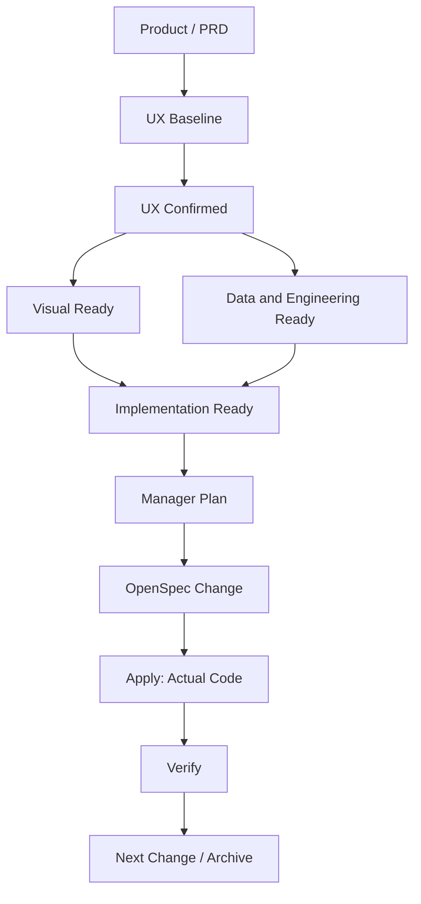

# AI 驱动的前端端到端交付与实施指南

> 适用范围：由 AI 协作完成从产品需求、UX、UI 设计到 React 实现、Mock、接口联调和验收的前端项目。
>
> 核心目标：先把产品、体验、视觉和数据边界整理成可执行输入，再由项目既有的 Manager/OpenSpec 工作流统一完成规划、编码、验证和归档，避免维护两套实施流程。

## 1. 最终结论

这份指南与 Manager/OpenSpec 的边界是：

```text
本文负责
Product / PRD
→ UX Baseline
→ Visual Ready + Data/Engineering Ready
→ Implementation Ready

既有 Manager/OpenSpec 负责
manager/plan.yaml
→ OpenSpec change artifacts
→ change→apply checkpoint
→ apply 实际代码
→ verify
→ repair 或显式 archive
```

严格来说，不是“开始写代码后再进入 OpenSpec”，而是**开始写代码前一步就进入 Manager/OpenSpec**：

- `manager-plan-from-doc` 把已确认需求规划成 change、batch 和依赖。
- OpenSpec 的 `proposal.md`、specs、`design.md`、`tasks.md` 把需求转成可执行方案。
- `apply` 才是实际代码修改的起点。
- 垂直切片、Mock、真实数据边界验证和视觉验收都是 `tasks.md` 与 verify 的内容，不是 OpenSpec 之外的新阶段。

因此，推荐主流程只有一条：

```text
Product / PRD
→ UX 结构、流程、状态和关键原型
→ Visual Foundation 与 Data Contract 并行就绪
→ Implementation Ready Handoff
→ Manager Plan
→ OpenSpec Change
→ Apply
→ Verify
→ 下一个 Change 或显式 Archive
→ Release
```

本文不重复 Manager 的状态机、review 参数、batch/wave 调度、repair loop 或归档命令；这些内容统一以 [OpenSpec Manager Flow](./openspec-manager-flow.md) 为准。

## 2. 文档职责与事实源

本文是“前置输入如何准备、如何交给代码流程”的指南，不是所有规则的副本：

| 问题                                   | 权威入口                                             | 本文职责                                           |
| -------------------------------------- | ---------------------------------------------------- | -------------------------------------------------- |
| 用户目标、业务规则、用户路径和验收口径 | 使用方项目的 `docs/prd/`                             | 说明如何形成 UX Baseline 和 Implementation Ready   |
| 接口契约、错误码、Mock 和联调约束      | 使用方项目的 `docs/api/` 或 canonical Schema         | 说明 Data Contract 如何成为 OpenSpec 输入          |
| Agent 行为、改动范围和验证授权         | [AGENTS.md](../../AGENTS.md)                         | 不复制执行硬约束，只说明进入代码流程后的读取入口   |
| 架构、代码、组件、目录和 UI 状态规则   | [Frontend Docs](../frontend/README.md)               | 连接 OpenSpec task 与现有代码规范                  |
| Manager/OpenSpec 执行生命周期          | [OpenSpec Manager Flow](./openspec-manager-flow.md)  | 只标明接管边界，不另建平行阶段                     |
| 当前计划和 change 状态                 | `manager/plan.yaml`、`openspec/changes/<change-id>/` | 本文不记录当前进度                                 |
| 视觉 Token                             | `src/shared/styles/tokens.css`                       | Style Demo 和 React 共同消费，不维护第二份长期来源 |

`docs/prd/README.md` 和 `docs/api/README.md` 在模板中只是使用方项目入口，不代表业务事实或接口契约已经就绪。

发生冲突时，不允许实现者自行选择：

```text
定位最上游事实源
→ 修正 PRD、UX、Design 或 Contract
→ 更新受影响的 OpenSpec artifacts 和 Scenario
→ 再修改代码与验证证据
```

## 3. Implementation Ready 之前的准备流程

### 3.1 聚合流程



| 前置阶段                   | 主要产物                                                                | 完成条件                                                   |
| -------------------------- | ----------------------------------------------------------------------- | ---------------------------------------------------------- |
| Product / PRD              | 目标、范围、非目标、业务规则、成功标准                                  | 没有影响方案的产品歧义                                     |
| UX Baseline                | Page Inventory、User Flow、State Matrix、关键 Prototype、可测试验收口径 | 页面、主路径、异常、返回和恢复操作完整                     |
| Visual Ready               | Visual Direction、Design Foundation、approved Token 规格/数值、必要参考 | 信息层级、布局、视觉语言、响应式和核心控件规则足以进入实现 |
| Data and Engineering Ready | Data Contract、Scenario Catalog、架构基线、环境和非功能约束             | 正式数据边界、错误、版本、Mock/Fake 策略和所有权明确       |
| Implementation Ready       | 上述输入的稳定锚点、候选 change 边界、风险和验证要求                    | Manager 能据此生成可执行 change，而不需要临场猜需求        |

这里的“Ready”表示**决策和输入足以规划实现**，不表示 Client、Repository、Mock Handler 或组件代码已经完成。这些代码产物应由后续 OpenSpec tasks 创建。

### 3.2 UX Baseline

UX 完整不等于为每个页面制作复杂原型。完整性由三个事实维度保证：

- Page Inventory：页面职责、入口、出口和权限没有遗漏。
- User Flow：主路径、取消、返回、冲突和异常分支没有遗漏。
- State Matrix：Loading、Empty、Error、Unauthorized、Forbidden、Validation、Success 和恢复操作没有遗漏。

推荐的 State Matrix：

| Page / Feature | Default | Loading | Empty | Error | Unauthorized | Forbidden | Validation | Success |
| -------------- | ------- | ------- | ----- | ----- | ------------ | --------- | ---------- | ------- |

每个需要实现的状态应形成以下关系：

```text
State Matrix 条目
→ Scenario ID
→ Mock / Fake 行为
→ UI 呈现与恢复操作
→ OpenSpec Scenario
→ 对应责任层测试
```

Prototype 只覆盖核心流程、结构或交互存在歧义的页面、弹窗/抽屉/多步骤流程，以及代表性的响应式变化。它是结构和交互参考，不是生产代码或最终视觉数值的事实源。

### 3.3 Visual Ready

Style Demo 不重新设计 UX。它必须继承已确认的信息层级、主要操作位置、跳转方式和状态位置；视觉阶段发现结构问题时，先回写 UX 事实源。

Visual Direction 至少定义：

- 主风格、内容密度、排版、配色和图片策略。
- 布局、留白、响应式、动效和 reduced-motion 原则。
- 参考对象及“具体参考什么”。
- 禁止出现的视觉套路。

Design Foundation 至少稳定颜色、字体、间距、形状、层次、布局和核心控件状态。前置阶段可以先在设计产物中确认 Token 架构与数值；创建或修改 `src/shared/styles/tokens.css` 属于实际代码，必须进入 OpenSpec `[ui]` task。

Token 落地后，Style Demo、Design Preview 和生产 React 必须消费同一个 `src/shared/styles/tokens.css`，不再维护一份可独立演进的长期设计 Token。draft/approved 是状态，不是两套运行时来源。

如果项目没有 Storybook、设计预览路由或截图基线，不得在任务中假设它们已经存在。是否引入这些能力由 OpenSpec change 明确决定。

### 3.4 Data and Engineering Ready

远端 API Contract 至少明确：

- URL、Method、请求参数、Body 和响应结构。
- 必填、`null`、日期、金额、枚举、分页和排序规则。
- `401/403/404/409/422/429/500` 及统一错误结构。
- 鉴权、刷新、幂等、兼容策略和 canonical owner。

纯前端本地产品不需要伪造 HTTP。此时把 storage schema、版本、迁移、序列化和失败行为视为 Data Contract：

```text
Page / Feature UI
→ Action / Query
→ Repository Interface
→ Local Storage Adapter
```

远端 API 的正式路径是：

```text
Page / Feature UI
→ Query / Mutation Hook
→ Slice API Module
→ src/shared/api/requestClient.ts
→ Generated Client（如项目已配置）
→ HTTP
```

Mock/Fake 必须位于正式网络或 Repository 边界。禁止 UI 直接 import fixture 形成只在 Mock 下存在的第二条数据路径。

当前模板没有预装 MSW、OpenAPI Generator、runtime schema validator 或 Storybook。需要时由明确的 OpenSpec change 引入，不能把不存在的依赖写成既有前提。

### 3.5 Implementation Ready Handoff

进入 Manager 规划前，至少提供以下输入：

| 输入                        | 最低要求                                                                 |
| --------------------------- | ------------------------------------------------------------------------ |
| PRD                         | 目标、范围、非目标、业务规则、用户路径和验收可定位                       |
| UX                          | Page/Flow/State 完整；关键 Prototype 无歧义                              |
| Visual                      | Design Foundation、approved Token 输入和必要参考足以支持首个生产 Feature |
| Data Contract               | 远端 API 或本地 Repository 的正式边界、错误和版本策略明确                |
| Scenarios                   | 主路径和关键边界能以稳定 Scenario ID 描述                                |
| Architecture                | Router、state ownership、data flow、目录和依赖方向有现有基线             |
| Delivery Constraints        | 环境、权限、性能、浏览器支持、显式非目标和外部依赖已记录                 |
| Verification Requirements   | 哪些逻辑必须测试，哪些场景需要运行/视觉证据，哪些动作需要额外授权        |
| Candidate Change Boundaries | 首个垂直切片和后续 Feature 的候选边界、依赖与共享写点可被 Manager 识别   |

不要求人工预先写好完整 `tasks.md`。Manager/OpenSpec 会消费这些稳定输入，生成 proposal、specs、design 和 tasks。

当 PRD 或明确的 downstream handoff/input 小节声明 UX、Visual、Contract、Scenario、架构或其他 supporting inputs 时，必须给出稳定 source；需要局部消费时再给出可定位锚点。Manager 的 inputs 机制本身可选且不限定领域：`manager-plan-from-doc` 只跟随明确交给 OpenSpec/实现/验证消费的声明，把每个独立 source 按消费 change 写入 `openspec[].inputs`；provenance、evidence、related docs 和工程规范引用不自动成为 input，主 PRD 不因子文档回链而重复映射。稳定 locator 能完整覆盖 change-specific 与 shared/global 内容时使用 `scope`，否则省略并由 execute 消费整个 source。`manager-execute-current-batch` 在各阶段解析并传入这些引用，必需输入缺失时在对应 entry 启动前停止。

## 4. Manager/OpenSpec 接管实现

### 4.1 唯一执行链

`Implementation Ready` 之后只走既有流程：

```text
docs/prd/ + UX/UI/Data/Architecture inputs
→ manager-plan-from-doc
→ manager/plan.yaml
→ manager-execute-current-batch: change
→ proposal / specs / design / tasks
→ openspec validate
→ review（按配置）与 change→apply checkpoint
→ manager-execute-current-batch: apply
→ frontend-dev 修改实际代码并勾选 tasks
→ qa + ui-ux-reviewer verify
→ 可修复失败由 execute 门内 Auto-Repair（最多 2 次）
→ terminal blocked 时由用户显式选择 manager-bugfix；通过则 phase: archive
→ 用户显式调用 manager-archive-completed
```

任何 `src/**` 修改，包括 `tokens.css`、Client/Repository、Mock Handler、组件和测试，都属于 `apply`；前置设计阶段不能绕过 OpenSpec 直接落生产代码。

这条链已经负责分步执行，所以本文不再设置“阶段 14 垂直切片 → 阶段 15 真实接口冒烟 → 阶段 16 Feature 交付”等平行状态。

### 4.2 OpenSpec artifacts 的职责

| Artifact           | 职责                                                                               |
| ------------------ | ---------------------------------------------------------------------------------- |
| `proposal.md`      | 定义 change 的目标、范围、非目标和影响                                             |
| `specs/**/spec.md` | 用 Requirement / Scenario 定义用户可观察行为                                       |
| `design.md`        | 定义本 change 的 entry、state、data/interaction flow、组件边界和技术取舍           |
| `tasks.md`         | 把设计拆成 `[logic]` / `[ui]` 编码项，声明依赖、文件范围、Scenario、验证和停止条件 |
| `verify-report.md` | 独立核对 task、spec、design、代码和验证证据                                        |
| `findings/`        | repair loop 的根因、回写和复验证据                                                 |

### 4.3 UI Skill 路由

Skill 只增强 artifact 或 task，不增加工作流阶段：

| 场景                                       | 标记                                            | 使用方式                            |
| ------------------------------------------ | ----------------------------------------------- | ----------------------------------- |
| 初始化或重做产品级视觉体系                 | `design.md` 明确属于 product-wide visual system | `$ui-ux-pro-max` + `$design-system` |
| 页面、组件、布局、响应式和视觉交互         | `tasks.md` 中的 `[ui]`                          | `Use $frontend-design`              |
| API、Mapper、Query、状态、路由和非视觉测试 | `tasks.md` 中的 `[logic]`                       | 不加载 `$frontend-design`           |
| apply 后 UI 走查                           | 含前端实现的 change                             | `ui-ux-reviewer` 只读验收           |

具体提示注入由 `openspec/config.yaml` 管理，角色路由由 `manager/roles.yaml` 管理。

## 5. 首个垂直切片作为第一个实现 Change

### 5.1 定位

垂直切片不是 Manager 之外的阶段，而是首个或首批 OpenSpec change 的拆分策略。它应形成一个真实业务 Feature 的最小生产闭环：

```text
真实 route / entry
→ 正式 state 和 data flow
→ 正式 API / Repository / Query / Mutation
→ 正式边界上的 Mock / Fake
→ 生产组件和样式
→ 主路径、关键异常和恢复操作
→ 工程检查与约定的运行证据
```

后续 change 复用的是经过验证的架构和实施方法，不是复制首个 Feature 的组件树。

### 5.2 如何选择

优先选择同时具备以下特征的 Feature：

- 属于核心用户路径，有真实业务价值。
- 至少包含一次读取或提交，以及成功后的可观察结果。
- 能代表主要页面布局和核心 UI 控件。
- 覆盖 `normal` 与至少两个高风险状态，例如 `empty`、`validation`、`error`、`forbidden`。
- 会经过正式 request client 或 repository adapter、错误归一化和缓存更新路径。
- 范围足够小，可以由一个 change 独立达到 Done。

不要选择纯静态欢迎页作为复杂应用的首个切片，也不要把整个 Dashboard 和全部子流程塞进一个 change。

### 5.3 `design.md` 必须回答的五项落点

| 决策                 | 必须回答的问题                                                                   |
| -------------------- | -------------------------------------------------------------------------------- |
| Entry                | 哪个 route 进入？route page entry 只负责哪些参数、composition 和页面级编排？     |
| State Ownership      | 哪些属于 server、URL、form、local 或跨页面 client state？谁是最近 owner？        |
| Data Flow            | UI event 如何到 action、query/mutation、API/repository，再如何映射回 UI？        |
| Interaction Flow     | 主操作、取消、返回、失败恢复、重复提交和导航恢复如何闭环？                       |
| Stable UI Boundaries | 哪些是页面私有区块、feature action、entity display、widget 或 shared primitive？ |

这些答案应引用项目规范，不在 change 中重新选择 Router、状态库、请求封装或目录体系。

### 5.4 `tasks.md` 必须承载的实现内容

首个垂直切片的 tasks 至少覆盖：

1. `[logic]` 类型、DTO/persisted record、Mapper、API/Repository 和错误边界。
2. `[logic]` Query/Mutation/action、cache 或持久化同步、提交防重和主要逻辑测试。
3. `[logic]` Mock Handler 或 Repository Fake，以及需要覆盖的 Scenario ID。
4. `[logic]` route、导航、权限或 URL state 接线。
5. `[ui]` page entry、稳定 UI 边界、shared UI 复用、Token、theme 和 i18n。
6. `[ui]` Loading、Empty、Error、Validation、Forbidden、Pending、Success 和恢复操作。
7. 精确的文件范围、依赖顺序、验证命令、运行矩阵、证据路径和停止条件。

真实数据边界验证也写入 OpenSpec，而不是另起流程：

- 测试 API 已可用时，在当前 change 中加入真实接口 smoke task 和验收证据。
- 外部环境尚未就绪时，默认保留在同一业务 change 中并明确标记阻塞原因；该 task 未完成前不能通过 verify。
- 只有联调工作具备独立交付、评审、风险或回滚边界时，才由 Manager 规划为带 `depends_on` 的 integration change；不能只因执行顺序不同就机械拆 change。
- 纯本地产品使用真实 Repository/Storage Adapter、刷新恢复和迁移验证替代 API smoke。
- 没有完成约定证据时，对应 task/change 不得声明 Done。

这样可以保留“尽早发现鉴权、CORS、日期、金额、枚举、`null`、分页和错误体问题”的质量目标，但不增加新的阶段状态。

### 5.5 Apply 开工读取顺序

OpenSpec apply 读取 change context 后，前端实现者按任务范围补读项目规范：

1. [AGENTS.md](../../AGENTS.md)：改动范围、验证策略和禁止动作。
2. [Frontend Development](../frontend/standards/frontend-development.md)：所有前端实现必读。
3. [Technology Options](../frontend/architecture/technology-options.md)：架构、分层、依赖和数据流。
4. [Components](../frontend/components/components.md)、[Component Splitting](../frontend/components/component-splitting.md)、[Component Inventory](../frontend/components/component-inventory.md)、[File Organization](../frontend/standards/file-organization.md)：页面、组件、表单、列表、复用和拆分。
5. [Component Definition](../frontend/standards/component-definition.md)：props、可控/非可控、数据边界和 shared primitive API。
6. [Accessibility And UI States](../frontend/standards/accessibility-and-ui-states.md)：UI 状态、表单、浮层、键盘和响应式文本。
7. `src/` 中的现有 entry、直接消费者、公开出口、Token 和相邻模块模式。

任务范围扩大时，再补读新增范围对应规范。本文不复制这些文件中的代码硬规则。

### 5.6 Apply 内部建议顺序

这些步骤属于同一个 change 的 task 依赖，不是新的项目阶段：

1. 对齐现有 route、providers、request client、错误模型、Token、i18n、theme 和组件 inventory。
2. 建立类型、Mapper、API/Repository、query key 和错误归一化边界。
3. 实现 Query/Mutation/action、retry、取消、cache/persistence 更新和重复提交防护。
4. 在正式边界接入 Mock/Fake，并用 Scenario ID 覆盖正常、边界和恢复场景。
5. 接入 route page entry，只保留路由参数、页面级 composition、状态归属和数据流编排。
6. 实现 page-private、feature、entity、widget 或 shared UI 的稳定边界。
7. 补齐 State Matrix 对应的 UI 状态、恢复操作、focus、键盘、响应式、theme 和 i18n。
8. 为业务分支、状态转换、Mapper、错误恢复、重复提交和公共契约补最小必要测试。
9. 执行 tasks 声明的范围检查和已授权运行验证，完成后立即勾选对应条目。

### 5.7 目录落点

首个切片直接使用当前项目分层，不另建 `features/<name>/components/pages` 体系：

| 职责                            | 推荐位置                              |
| ------------------------------- | ------------------------------------- |
| 应用装配、Provider、集中 Router | `src/app/`                            |
| route-level composition         | `src/pages/<page-name>/`              |
| 页面私有 UI 或 model            | `src/pages/<page-name>/ui/`、`model/` |
| 页面级复合区块                  | `src/widgets/<widget-name>/`          |
| 用户动作或业务流程              | `src/features/<feature-name>/`        |
| 领域类型、展示和领域级逻辑      | `src/entities/<entity-name>/`         |
| 无业务、跨模块稳定复用能力      | `src/shared/`                         |

只有一个消费者的简单 JSX 不提前抽组件；已形成命名组件时使用 `ComponentName/ComponentName.tsx`、CSS Module 和 `index.ts`。至少两个稳定场景复用且去除业务语义后，才考虑提升到 shared。

### 5.8 验证证据

“Mock 下完整流程和视觉验证通过”需要在 tasks/verify 中拆成不同证据：

| 证据层       | 证明什么                                                | 常见方式                                  |
| ------------ | ------------------------------------------------------- | ----------------------------------------- |
| 自动行为验证 | Scenario 可触发，状态、动作和恢复结果正确               | Unit / Component + Mock/Fake              |
| 运行交互验证 | route、导航、焦点、键盘、连续操作和响应式在运行环境成立 | 人工走查或经明确授权的 browser automation |
| 视觉验证     | 指定场景和视口下，布局、Token、文字和状态符合设计基线   | 人工对比或经明确授权的固定视口截图对比    |
| 真实边界验证 | API 或 Storage Adapter 与 Contract 一致                 | smoke、contract check 或刷新/迁移验证     |

需要 dev server、build、browser automation、外部测试环境或截图时，task 必须显式写出前置条件、route、Scenario、viewport、runtime mode、命令和证据路径，并获得当前任务要求的授权。

### 5.9 Change 完成定义

首个垂直切片 change 只有同时满足以下条件才可通过 verify：

- specs 的相关 Requirement / Scenario 有可达实现。
- tasks 对应代码和主要逻辑测试真实完成。
- 使用生产 route、正式数据边界、项目 Provider、Token、theme、i18n 和现有 shared UI。
- DTO 不直接贯穿 UI，未知枚举、错误和失败恢复在边界处理。
- page entry、组件层级、公开出口和依赖方向符合 `docs/frontend/`。
- Mock/Fake 使用与生产相同的调用边界。
- tasks 要求的自动、运行、视觉和真实边界证据已经完成；未授权或未执行的证据不得声明通过。
- QA 与 UI/UX verify 没有 CRITICAL 阻塞项。
- 没有未记录的 PRD、Design、Contract 或实现偏差。

## 6. 后续 Feature 与系统验收

首个切片完成后，Manager 继续从 `manager/plan.yaml` 选择下一个 change。每个 Feature 仍走同一条 `change → apply → verify` 链，不在本文增加 Feature Delivery Loop 状态。

后续 change 复用：

- 已确认的 Design Foundation 和 Token。
- 已验证的 state/data/interaction flow 模式。
- request client 或 Repository、错误归一化和 Mock/Fake 边界。
- 目录、组件分层和验证责任。

后续 change 不复制：

- 首个 Feature 的业务组件树。
- 只服务首个页面的 model、fixture 或状态。
- 为“未来可能复用”建立的提前抽象。

跨 Feature 的系统验收、release build、部署、监控和回滚属于 release 范围。OpenSpec archive 只表示 change artifacts 已同步归档，不等于产品已经发布。

## 7. 验证策略

### 7.1 项目默认范围

进入 apply 后，验证以 [AGENTS.md](../../AGENTS.md) 为准：

| 改动范围                                                      | 默认验证                                              |
| ------------------------------------------------------------- | ----------------------------------------------------- |
| 主要业务逻辑、状态转换、Mapper、错误恢复                      | 相邻 Vitest 测试                                      |
| JSX、hook 依赖、import、公共 API 或类型契约                   | 受影响文件 ESLint + 项目级 `pnpm typecheck`           |
| shared 基础设施的多个行为边界，影响无法可靠收窄               | `pnpm test`                                           |
| `package.json`、Vite、TypeScript、ESLint、Prettier 或跨层规则 | `pnpm check`                                          |
| 仅 CSS，不改变 DOM 或交互                                     | 不要求单测；检查响应式、溢出、focus、theme 和必要状态 |
| 仅 Markdown / YAML                                            | 不跑前端单测；运行范围内 format 或对应 validator      |

`dev server`、`build`、浏览器自动化、截图和 E2E 不因“前端任务”或笼统“验证”自动获得授权。需要这些证据时，由 OpenSpec task 或当前用户请求明确要求。

### 7.2 OpenSpec 质量门

本文不再维护 Gate 4A、Gate 4B、Feature Done 等另一套状态。质量门映射到既有流程：

| 位置    | 质量要求                                                                               |
| ------- | -------------------------------------------------------------------------------------- |
| change  | artifacts 完整、`openspec validate` 通过、review/checkpoint 满足配置                   |
| apply   | tasks 按依赖完成，代码检查与要求的运行证据通过                                         |
| verify  | QA 核对 specs/tasks/design，UI/UX reviewer 核对交互、Token、状态和组件一致性           |
| repair  | apply gate 的可修复失败在 execute 内最多自动修复 2 次；终态问题再由用户显式发起 bugfix |
| archive | 只有 verify 通过且用户显式要求时执行                                                   |
| release | 独立确认 build、部署、监控、回滚和发布验收                                             |

Manager 负责推进状态，OpenSpec artifacts 负责定义“要做什么”，`docs/frontend/` 负责定义“代码怎么写”。三者不能互相替代。

## 8. 变更传播

### 8.1 UX 或业务行为变化

```text
docs/prd/ 中最上游条目
→ 更新 UX Flow / State / Prototype
→ 更新 manager plan 中受影响的 change 边界或依赖
→ 更新 OpenSpec specs / design / tasks
→ 更新 Scenario、Mock/Fake 和测试
→ 再修改 React
```

### 8.2 视觉变化

```text
Visual Direction / Design Foundation / tokens.css
→ 更新 Style Demo 或设计参考
→ 更新受影响 change 的 design / [ui] tasks
→ 更新 React 和约定的视觉证据
```

禁止只在某个业务组件中写临时颜色、圆角或间距绕过 Token。

### 8.3 Data Contract 变化

```text
Canonical API / Storage Contract
→ 更新受影响的 manager dependency / OpenSpec artifacts
→ 重新生成 Client / Types（如已配置）
→ 更新 Repository、Mock/Fake、Mapper、Query / Mutation
→ 运行直接相关测试与真实边界验证
```

禁止直接修改生成目录，也不要用 `as any` 掩盖契约偏差。

### 8.4 实现发现上游问题

实现者停止受影响 task，并指出冲突来源。行为问题回写 PRD/spec，技术方案问题回写 design，执行拆分问题回写 tasks，数据问题回写 canonical Contract；如果影响 change 边界或顺序，先回写规划来源，再通过 Manager 流程重排，不能直接手改 `manager/plan.yaml` 状态。

## 9. 推荐职责结构

```text
docs/
  prd/                         # 产品、UX 和验收输入
  api/                         # Contract、Scenario 和联调输入
  frontend/                    # 架构、编码、组件和项目指南
  ai/
    ai-frontend-delivery-best-practice.md
    openspec-manager-flow.md

manager/
  plan.yaml                    # 当前批次、依赖和 phase
  roles.yaml                   # 角色路由

openspec/
  config.yaml                  # artifact rules 和 Skill 提示注入
  specs/                       # archive 后主规范
  changes/
    <change-id>/
      proposal.md
      design.md
      tasks.md
      specs/
      verify-report.md
      findings/

src/
  app/
  pages/
  widgets/
  features/
  entities/
  shared/
    api/
    config/
    hooks/
    icons/
    styles/
      tokens.css
    testing/
    ui/
    utils/
  mocks/                        # 仅在项目明确接入 Network Mock 后存在
```

业务 API、query、mutation、types 和 tests 归属于拥有其语义的 page、feature 或 entity。`shared/api/` 只承载 request client、通用错误归一化或生成 client 等基础能力。

## 10. 不同规模项目如何裁剪

### 10.1 简单展示页

可以合并 Product、Page Inventory、Flow 和 State 为轻量 UX Spec。若没有复杂数据和多个 change，可直接使用一个 OpenSpec change，不需要强行创建 Network Mock、复杂 Data Layer 或完整组件库。

### 10.2 标准 SaaS / Web App

完整准备 UX、Visual 和 Data Contract，形成 Implementation Ready 后交给 Manager 拆分首个垂直切片及后续 Feature changes。

### 10.3 大型、金融、医疗或高风险系统

在同一链路上增加权限矩阵、审计、Contract Compatibility、ADR、威胁建模、合规验收、完整证据留存和更严格的 release 门禁，不另建第二套开发状态机。
